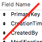
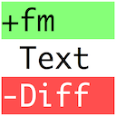

1. TOC
{:toc}



# {{page.title}}

{{page.strapline}}

## The Setting

The technical specification **EN16931** has long prepared the path for **electronic invoicing in the EU**.

At first there was little interest from the commercial sector in Germany (at least from our customers), but as 2024 progressed at last 'the penny dropped'… **electronic invoicing is *really* coming to Germany** …and quite imminently!

Moreover, the task ahead had just exploded, morphing

- from the (relatively) simple (legally required) task of ***receiving* an e-invoice**
- to the (much more) complicated (optional) task of ***generating* and *sending* a *valid* e-invoice**.

At [Günther Business Solutions GmbH](https://guenther-bs.de/) we scrambled to master the situation - and managed to create a great solution in a few very intensive months' consultation and programming.

## An e-Invoicing Solution

 The solution we developed for the [advanter ERP system](https://guenther-bs.de/advanter/) was a two file module: one file for the code and one for the customer's data.

Advanter is a multi file solution.

{: .mrw-full-width}

The e-Invoice solution adds two more files to advanter:

{: .mrw-full-width}

The modular concept allows simple communication of the e-invoice via Script API and JSON:

{: .mrw-full-width}

The elements of the solution include

- Two new Files
- A few file references and authorisations
- A handful of custom functions
- A few extra fields in various tables & layouts
- A new table of normalised line items [^1]
- A single value list to select the target e-invoice format [^2]
- Several extra scripts, inc.
  - Integration in central navigation, startup, etc.
  - Generation of the normalised line items and e-invoice source data
  - The e-invoice API call & response handling
- A few system data records

## The Problem



 **The Problem(s) TL;DR:**

- Customers who
  - can't update
  - have heavily customised deployments
  - have old systems
    - old deployments
    - old FM
    - old OS
    - old HW
- Backporting code into Live DB
  - Update FM/OS/Hardware
  - Clean setup
- Old versions
  - Missing functionality
  - Renaming
- Customisations
- Patching old systems
  - What to transfer
    - Deciding
    - Diffing
  - Order of Transfer
  - Documenting the to dos
  - Finding the code to transfer
  - Transferring the code
    - Remote Desktop Tool?
  - Handling renamed code?
  - Catching patching errors
  - Checking Code is ok
- File authorisation (!)


{{ the_problems | markdownify }}
{: .float-front-right .w-33pc .light-grey-bg}

Whilst our preferred delivery method would have been to update all our customers to this new version of the software, there was a problem:

{: .mrw-red-bg}
A number of customers - about 15 - were stranded in old legacy versions of the software, requiring GBS to [backport](glossary.html#backport) this new functionality into their old systems. 😕

{: .mrw-gold-bg}
Backporting is the action of porting new functionality to old systems

### The Headaches of Backporting Code

As you may know, backporting code into old databases is always a real headache. Databases evolve over time, and it is only natural that things get improved, renamed, extended, restructured. Importing or copy-pasting code between different versions of a database always leads to broken code, and we needed to minimise / eradicate this risk.

Whilst the files were designed to be modular, there was a still a rather large overhead of programming that was needed in the legacy systems to integrate these modules into the legacy framework.

The to do list included, amongst many other things

- **ensuring a clean programming environment**
- **deploying the two new files** to the customers server
- **integrating the two new files** into advanter's standard processes, inc.
  - file authorisation, account & window management, solution startup & shutdown, etc.
- **adding or updating code** to support the new e-Invoice process:
  - custom functions, fields, value lists, layouts, scripts, …
  - settings fields for the e-Invoice process
  - new, normalised line item table to pre-process the data
  - modifying the invoice print script to construct the electronic invoice data as json and interact with the new e-Invoice module



In other words, the backporting process required

- a lot of manual changes
- in a lot of different systems

We needed to get efficient!

<section>{{ action_summary | markdownify }}</section>{: .fullwidth .mrw-gold-bg}

## The Solution: MrWatson's Tools to the rescue

MrWatson's tools - together with a Slack canvas - proved to be most useful in many aspects of this backporting process.

Here is a list of the tools we used, and how they helped.

- {:.float-front-right .w-32}[Slack Canvas](https://slack.com/intl/en-gb/features/canvas)
  - was used to construct the to do list within our team communication software, [Slack](https://slack.com/).
  - It supports markdown text, images, checkboxes, collapsible headings and http-links.
- [fmIDE](fmide.html) {:.float-front-right .w-32}
  - was used to deep link to the code that needed to be ported  directly ([^3]) from the Slack Canvas to do list.
  - This tool really shone in this process!
- MrWatson's [fmWorkMate](fmworkmate.html) toolbox {:.float-front-right .w-32}
  - was installed both on the source and target computers to provide all the magic of the tools and facilitate the fastest code transfer on the planet
- [fmLaunchPad](fmlaunchpad.html) {:.float-front-right .w-32}
  - made it possible to launch fmWorkMate in its own FileMaker instance
- Setup tools
  - [fmSetupAssistant](fmsetupassistant.html) {:.float-front-right .w-32}
    - was used to make sure that the FileMaker programming environment on the customers computer was setup correctly
  - [fmKillDefaultFields](fmkilldefaultfields.html) {:.float-front-right .w-32}
    - to make sure that the customer's database was clean of default fields
  - [fmSyntaxColorizer](fmsyntaxcolorizer.html) {:.float-front-right .w-32}
    - was used on Mac computers to make sure that errors in scripts - particularly variable typos - were immediately visible

- [fmCheckmate](fmcheckmate.html) {:.float-front-right .w-32}
  - to transfer code from our master database to the customer's deployment
- [fmAutoMate](fmautomate.html) {:.float-front-right .w-32}
  - to transfer code even quicker using [Xopy 'n' PaXte](xopy-n-paxte.html)

- [fmLogAnalyzer](fmloganalyzer.html) {:.float-front-right .w-32} and the BugOff! Alarm
  - to catch pasting errors as we made them
  - and to turn the errors in a still-to-do list
- [fmCheckMate-XSLT](fmcheckmate-xslt.html) {:.float-front-right .w-32} library
  - primarily for layout analysis to check no pasting errors crept into customers' layouts.
- [fmDBAnalyzer](fmdbanalyzer.html) {:.float-front-right .w-32}
  - for the specific task of checking the new TOs in the relationship graph.
- [fmTextDiff](fmtextdiff.html) {:.float-front-right .w-32}
  - to check how the customer's code and our code differed

---

## Footnotes

[^1]: Due to the advanced features of Advanter's line item functionality the solution also required a new table of normalised line items.

[^2]: A value list allows selection of the target e invoice format. This is not without problems: It is a schema reference to the eRechnungAPI file, and as such during an update of the e-invoicing module it  makes it impossible to close the eRechnungAPI file on the server without the users who have used the value list having to close ALL files. In a future version I hope to replace this with a script based magic value list to remove this irritation. 
[^3] Since the Slack Canvas does not support fmp urls they get changed into http-urls, and you have to do a little dance in the browser address field to turn the url back into an fmp link.
