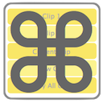
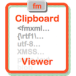
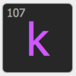

- TOC
{:toc}



# {{page.title}}

{{page.strapline}}

Manage clipboard and keyboard easily.

The Clip + Key Tool group is a collection of tools to work with your clipboard and keyboard.

## Clipboard Tools

The clipboard is one of the most important tools in a developer's toolbox, and many of Mrwatson's work closely with the clipboard to make your life easier.

{: .float-front-right .w-48}
- [fmCheckMate]
  - Of course, **the most important clipboard tool is [fmCheckMate]**, which is to be found in pole position in the [Developer Tools](./developer-tools.html) group.

  {: .float-front-right .w-48}
- [fmPasteMate]
  - A simple tool for remembering more than one clipboard item when transferring code between solutions.

  {: .float-front-right .w-48}
- [fmClipboardViewer]
  - Helps you understand what is on your clipboard, and is invaluable for debugging FileMaker clipboard problems!

## Keyboard Tools

{: .float-front-right .w-48}
- [fmAutomate]
  - The most important keyboard tool is fmAutomate, which is to be found at the top of the [Integration Tools] group. fmAutomate brings power to your finger tips with its keyboard shortcuts and extended keyboard functions.

{: .float-front-right .w-48}
- [fmKeyPress]
  - Press a key. It tells you the code.

  {: .float-front-right .w-48}
- [fmModifierKeys]
  - Just show which modifier keys are being pressed.

{: .note}
Check out [MrWatson's keyboard shortcut cheatsheet]( mrwatsons-keyboard-shortcut-cheatsheet.html) for more keyboard shortcuts and tips to speed up your FileMaker development!

or

{: .mrw-killer-bg}
read about [Killer Keyboard Mode](killer-keyboard-mode.html) in MrWatson's Tools to learn how to use keyboard shortcuts to annihilate your tasks in a fraction of the time it would take you to do it manually.

mrwMarkdownLinks
[fmAutomate]: fmautomate.html
[fmCheckMate]: fmcheckmate.html
[fmClipboardViewer]: fmclipboardviewer.html
[fmKeyPress]: fmkeypress.html
[fmModifierKeys]: fmmodifierkeys.html
[fmPasteMate]: fmpastemate.html
[Integration Tools]: integration-tools.html
