- TOC
{:toc}



# {{page.title}}

{{page.strapline}}

{: .note .w-50pc}
When something breaks in a FileMaker database, does it log an error?

## The Problem

When moving code around, patching files, or generally copy + pasting stuff from A to B, it's quite easy to break things.

{: .float-front-right .w-64}

### The Good

FileMaker tries to help in the form of the `import.log` which gets written to when you paste something in.

#### The circle of quality-control-happiness(*)

```mermaid
---
config:
  layout: dagre
---
flowchart LR
    You((You))
    FMP[("FileMaker
    Pro")]
    log[/"📄 import.log"/]

    You -. "1. Paste code"        .-> FMP
    FMP == "2. writes errors"     ==> log
    log == "3. discover errors"   ==> You
    You == "4. find + fix errors" ==> FMP
```



(*) …theoretical…

### The Bad

{: .hover-accordion}

- 💢 Some things are not logged at all
  - `Layout Objects`
  - `Custom Menus`
- ❓ Some things are logged, but not as errors
  - `Custom functions` are mentioned, but errors are not logged
  - Things that get renamed are not logged as errors
  - Automatically created `External Data Sources` are also not logged as errors
- ⁉️ Some problems are logged, but are unimportant
  - Errors in cancelled imports can distract
- 🔍 Finding the error in the log is one thing
  - navigating to the errorneous object in the soluton is another problem entirely

```mermaid
---
config:
  layout: elk
---
flowchart LR
    Paste["⌘V
    Paste
    code"]
    File[("MyFile.fmp12")]
    FMP[("FileMaker
    Pro")]
    log[/"📄 import.log"/]
    NONE[/"💢 NONE"/]

    Paste -.> FMP .-> File

    File ==> EDS["External Data Source"]
    File ==> VL["Value Lists"]
    File ==> TAF["Tables & Fields"]
    File ==> SCR["Scripts & Steps"]
    File ==> CF["Custom Functions"]
    File ==> THM["Themes"]
    File ==> LAY["Layout Objects"]
    File ==> CM["Custom Menus"]

    VL  -- ✅ logs errors OK                --> log
    TAF -- ✅ logs errors OK                --> log
    SCR -- ✅ logs errors OK                --> log
    THM -. ✅ logs errors(?) OK             .-> log
    EDS -. 🔶 logs, but not as an error     .-> log
    CF  -. ❌ logs, but *lies* about errors .-> log
    LAY -. ❌ no logging at all             .-> NONE
    CM  -. ❌ no logging at all             .-> NONE
```



And we won't mention - let alone dream about - the things you can't copy & paste in FileMaker. 😜

{: .float-front-right .w-50pc}

### The Ugly

The `import.log` file  is ugly.

- It is hard to read.
- It is hard to find the errors in.
- It is so hard, that you mostly just don't bother.

## MrWatson's Solutions

Three of MrWatson's Tools come to the rescue here…

1. [fmLogAnalyser](#fmloganalyser)
2. [fmCheckMate](#fmcheckmate)
3. [fmIDE](#fmide)


{: .float-front-right .w-64}

### fmLogAnalyser

First and foremost you need [fmLogAnalyser](./fmloganalyser.html) to help you make the most of the `import.log`.

#### fmLogAnalyser for Visualising the import.log


#### fmLogAnalyser for Proving you are Right

fmLogAnalyser turns your errors into a to-do list.

Once you have meticulously fixed all the errors in the log and ticked them off, the big


sign tells you you have no more errors.

{: .note .w-50pc}
Proof you have done your work right!

{: .float-front-right .w-64}

#### fmLogAnalyser for Active Bug-Hunting

Use [fmLogAnalyser's BugOff! Alarm](fmloganalyser-and-the-bugoff-alarm.html) to actively tell you when something has broken.

{: .float-front-right .w-64}

### fmCheckMate

To catch errors in `Custom Functions`, `Custom Menus` and `Layouts`, we need a different approach, since the log is useless here.

{: .float-front-right .w-64}

For this you'll need [fmCheckMate] and the [fmCheckMate-XSLT] Library

#### fmCheckMate for Custom Function Analysis

…after you paste them in, but *before* you close the `Custom Functions` dialog,…

- Copy the `Custom Functions` back to the clipboard
- With fmCheckMate convert them to XML
- Click `[T]` or press <kbd>⌘T</kbd> to choose an XSLT transformation
- Select the analysis function `List functions that seem to be commented out`
- You get a list of suspect `CFs`

If the list is empty, you can go back and save the `custom functions`, and if not you can break off, fix the problems and repeat.

#### fmCheckMate for Layout Analysis

With fmCheckMate and the fmCheckMate-XSLT Library you can [perform an instant analysis on any layout](layout-analysis-with-fmcheckmate.html) in your solution.

#### fmCheckMate for Custom Menu Analysis

I still need to implement that :D

{: .float-front-right .w-64}

### fmIDE

#### for a Quick Fix

Finally, [fmIDE] cuts through the last problem by navigating you straight to the erroneous object.

## Happiness is a double-helix of quality-control

There are indeed *two* circles of quality-control-happiness:

1. The circle of quality-control-happiness for main, logged objects

   - `Value Lists`
   - `Tables & Fields`
   - `Scripts & Steps`
   - `Themes`
   - `External Data Sources` (passively)

    ```mermaid
    ---
    config:
    layout: elk
    ---
    flowchart LR
        You((You))
        FMP[("FileMaker
        Pro")]
        log[/"📄 import.log"/]
        errors{"errors"}

        You == "1. Paste code"         ==> FMP
        FMP == "2. writes *some* errors" ==> log

        subgraph mrwatsons-tools["MrWatson's Tools"]
            fmLA[["fmLogAnalyser"]]
            alarm[["Bug-Off Alarm"]]
            fmIDE[["fmIDE"]]
        end

        log    == "3. read by"      ==> fmLA
        fmLA   == "4. triggers"     ==> alarm
        alarm  -- "5. warns"        --> You
        alarm  == "6. calls 'Name that Thing' API" ==> fmIDE
        fmIDE  == "7. navigates to" ==> errors
        errors -. "in"              .-> FMP
        You    == "8. directly fix" ==> errors
    ```

2. The circle of quality-control-happiness for secondary, non-logged objects

   - `Custom Functions`
   - `Custom Menus`
   - `Layout Objects`

    ```mermaid
    ---
    config:
    layout: elk
    ---
    flowchart LR
        You((You))
        FMP[("FileMaker
        Pro")]
        errors{"errors"}

        You == "1. Paste code"      ==> FMP
        FMP == "2. copy code back"  ==> You

        subgraph mrwatsons-tools["MrWatson's Tools"]
            fmCM[["fmCheckMate"]]
            fmCMX[["fmCheckMate-XSLT"]]
            fmIDE[["fmIDE"]]
        end

        You    == "3. Convert copied code to XML"  ==> fmCM
        fmCM   == "4. analyse XML"                 ==> fmCMX
        fmCMX  == "5. Press 'Go to Thing' Button"  ==> fmIDE
        fmIDE  == "6. navigates to"                ==> errors
        errors -. "in"                             .-> FMP
        You    == "7. directly fix"                ==> errors

    ```

mrwMarkdownLinks
[fmCheckMate]: fmcheckmate.html
[fmCheckMate-XSLT]: fmcheckmate-xslt.html
[fmIDE]: fmide.html
[fmWorkMate]: fmworkmate.html
[MBS Plugin]: mbs-plugin.html
[MrWatson's Tools]: mrwatsons-tools.html
