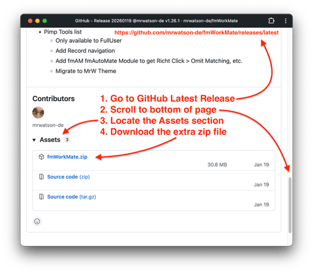
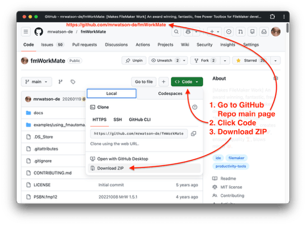

- TOC
{:toc}



# {{page.title}}

{{page.strapline}}

MrWatson's tools are hosted on GitHub, so you'll need to know how to download stuff from GitHub.

GitHub can be a bit daunting at first, so here is a quick cheat sheet.

## Downloading the latest stable release

To download a tool from GitHub, for example fmWorkMate, simply…

1. Navigate to the latest releases page on GitHub by following a link on this website / in fmWorkMate, or enter the URL directly into your browser…
   - `https://github.com/«github-user-name»/«tool-name»/releases/latest`
   {: .float-front-right .w-50pc}
   - For example
     - [fmWorkMate]
       - `https://github.com/mrwatson-de/fmworkmate/releases/latest`
     - [fmAutoMate]
       - `https://github.com/mrwatson-de/fmautomate/releases/latest`
     - [fmIDE] 
       - `https://github.com/fmide/fmide/releases/latest`
2. Scroll to the bottom of the page to the Assets section
3. Click on the zip file to download it
4. Unzip the archive
5. Follow the instructions to place the tool where it belongs (see the installation instructions for the tool you downloaded), or, generally:
   1. For [fmWorkMate]:
      - Move the unzipped folder to your `Applications` folder (or wherever you like to keep your apps)
   2. For fmWorkmate external tools:
      - Move the unzipped folder to be a *neigbouring folder of your fmWorkMate folder*
   3. For [fmCheckmate-XSLT]:
      - Rename the unzipped folder to `fmCheckmate`, if necessary, and move it to your `Documents` folder so that the xslts are located at `~/Documents/fmCheckmate/xsl/«subfolder»/«file.xsl»`
6. Double-click the tool to launch in FileMaker Pro

## Downloading the latest cutting-edge version

If you want the latest cutting edge version (with cool, new bits but more bugs) of a tool instead of the latest stable release, you can download the latest code from the main repo page.

1. Navigate to the main repo page on GitHub by following a link on this website / in fmWorkMate, or enter the URL directly into your browser…
   {: .float-front-right .w-50pc}
   - `https://github.com/«github-user-name»/«tool-name»/releases/latest`
   - For example
     - `https://github.com/mrwatson-de/fmworkmate/releases/latest`
     - `https://github.com/fmide/fmide/releases/latest`
2. Click the green `Code` button
3. Click `Download ZIP`
4. Unzip the archive
5. Note: You'll need to rename the unzipped folder to remove the suffix (`-main` or similar)[^1]  e.g. `fmWorkMate` instead of `fmWorkMate-main`) before coninuing with the installation, as above.

[^1]: The suffix identifies which branch the code came from, which is usually the main branch (thus  `-main`)

mrwMarkdownLinks
[fmAutoMate]: fmautomate.html
[fmCheckmate-XSLT]: fmcheckmate-xslt.html
[fmIDE]: fmide.html
[fmWorkMate]: fmworkmate.html
