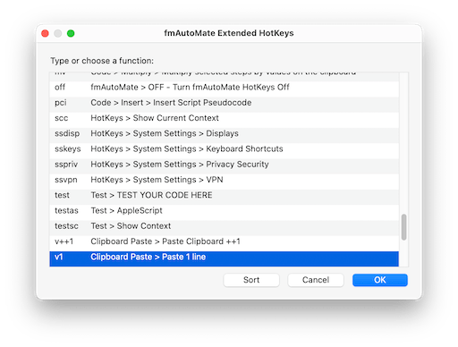

[{: .mrw-github-corner}]({{page.github_latest}})

- TOC
{:toc}



# {{page.title}}

{{page.strapline}}

A tool for FileMaker developers which extends and automates your script workspace and FileMaker environment to provide you with some awesome functions to boost developer productivity[^1].

TL;DR: [Install fmAutoMate](#install-fmautomate) funtionality once; get joy from it every day.


- Context menus for developer:
  - Script Workspace
  - Layout Workspace
- Context menus for end users:
  - in Browse Mode
  - in Find Mode
<section class="note float-front-right">{{ menus | markdownify }}</section>

{: .float-front-right}

## fmAutoMate Context Menus

fmAutoMate, above all, builds on the MBS Plugin's context Menu functionality to add powerful context menus to several FileMaker workspaces:

In the Script Workspace, fmAutoMate adds a context menu with mega functions to pimp your productivity.

### For example: Refactor Code

Use fmAutoMate's `Code > Refactor > Set Field if not Equal` function to refactor your code and set a field only if the new value is different from the current value.

- Avoids unnecessary Commits
- Keeps record modification information pure and clean.
- Above all: faster Code!

{: .note}
Read more about [fmAutoMate Context Menus].

## fmAutomate HotKeys

[fmAutomate] brings power to your fingertips through [fmAutoMate HotKeys](https://github.com/mrwatson-de/fmAutoMate/wiki/fmAutoMate-HotKeys).

HotKeys are shown in the context menu next to the function they trigger:

### Power at your fingertips

The power of fmAutoMate HotKeys is that

- they can be used anywhere in FileMaker Pro,
- they can be used even when the context menu itself is not available.

Here is a selection of the best fmAutoMate HotKeys:

| Action                     | HotKey                                              | Usable
|----------------------------|:---------------------------------------------------:|---------
| Xut (Cut to XML)           | <kbd>⌃</kbd><kbd>⌘</kbd><kbd>X</kbd>                | anywhere in FileMaker Pro
| Xopy (Copy to XML)         | <kbd>⌃</kbd><kbd>⌘</kbd><kbd>C</kbd>                | anywhere in FileMaker Pro
| PaXte (Paste XML)          | <kbd>⌃</kbd><kbd>⌘</kbd><kbd>V</kbd>                | anywhere in FileMaker Pro
| Reveal this file in Finder | <kbd>⌃</kbd><kbd>⌘</kbd><kbd>R</kbd>                | anywhere in FileMaker Pro
| Duplicate Script Step      | <kbd>⌃</kbd><kbd>⌘</kbd><kbd>⇧</kbd><kbd>D</kbd>    | anywhere in FileMaker Pro

### Memorable HotKeys

fmAutoMate HotKeys have been designed to be memorable and easy to use.

fmAutoMate has four combinations of modifier key it uses

| For Action           | Use      | Modifier Keys
|----------------------|:--------:|---------------
| [Main HotKeys]       | `⌃⌘`     | `control` + `command` + key
| [Navigation HotKeys] | `⌃⇧`     | `control` + `shift` + key
| [Extended HotKeys]   | `⌃⌘ K` … | `control` + `command` + K, then some more keys
| [Seldom HotKeys]     | `⌃⌥⌘`    | `control` + `option` + `command` + key

{: .note}
 Read more about fmAutoMate HotKeys on the [fmAutoMate Wiki HotKeys Page].

{: .float-front-right}

### fmAutoMate Extended HotKeys

[fmAutoMate Extended HotKeys] can be opened by pressing <kbd>⌃</kbd><kbd>⌘</kbd><kbd>K</kbd>

{: .note}
See the [fmAutoMate Extended HotKeys] page for details.

## fmAutoMate fmAM Script Module

The `fmAM Script Module` is a group of scripts that you can paste into your files to extend the context menus with script-based functionality.

{: .note}
More about [fmAutoMate fmAM Script Module].

## fmAutomate Services

[fmAutoMate Services] are Mac OS services that you can install into the Mac OS Services menu to add functionality to text fields and editors anywhere on your computer that text services are supported.

## Install fmAutoMate

{: .float-front-right}

When you open fmAutoMate in FileMaker Pro and press the `fmAutoMate` button, the following goodies are installed into your FileMaker GUI:

- [fmAutoMate Script Workspace Context Menu](fmautomate-context-menus.html#fmautomate-script-workspace-context-menu) <kbd><samp>Right-click</samp></kbd>
- [fmAutoMate Layout Workspace Context Menu](fmautomate-context-menus.html#fmautomate-layout-workspace-context-menu) <kbd><samp>Right-click</samp></kbd>
- [fmAutoMate Browse Mode Context Menu](fmautomate-context-menus.html#fmautomate-browse-mode-context-menu) <kbd><samp>Right-click</samp></kbd>
- [fmAutoMate Extended HotKeys](fmautomate-extended-hotkeys.html) Dialog (<kbd>⌃</kbd><kbd>⌘</kbd><kbd>K</kbd>) **available everywhere** in the FM GUI

[^1]: including, in some cases, making the impossible possible. 😜

mrwMarkdownLinks
[Extended HotKeys]: https://github.com/mrwatson-de/fmAutoMate/wiki/fmAutoMate-HotKeys#fmautomates-extended-hotkeys--k
[fmAutomate]: fmautomate.html
[fmAutoMate Context Menus]: fmautomate-context-menus.html
[fmAutoMate Extended HotKeys]: fmautomate-extended-hotkeys.html
[fmAutoMate fmAM Script Module]: fmautomate-fmam-script-module.html
[fmAutoMate Services]: fmautomate-services.html
[fmAutoMate Wiki HotKeys Page]: https://github.com/mrwatson-de/fmAutoMate/wiki/fmAutoMate-HotKeys
[Main HotKeys]: https://github.com/mrwatson-de/fmAutoMate/wiki/fmAutoMate-HotKeys#fmautomates-main-hotkeys-
[Navigation HotKeys]: https://github.com/mrwatson-de/fmAutoMate/wiki/fmAutoMate-HotKeys#fmautomates-navigation-hotkeys-
[Seldom HotKeys]: https://github.com/mrwatson-de/fmAutoMate/wiki/fmAutoMate-HotKeys#fmautomates-seldom-action-hotkeys-
