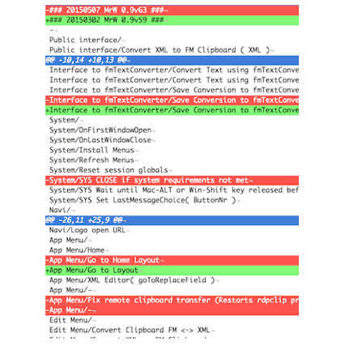

[{: .w-32}{: .mrw-github-corner}]({{page.github_latest}})

- TOC
{:toc}



# {{page.title}}

{{page.strapline}}

The fmCheckMate-XSLT is a library of functions that plug into [fmCheckMate] via the `[T]` Transform button.

## Installation

1. [Download the latest release]({{page.github_latest}}) from GitHub and install it:
  - unpack it
  - rename it to just `fmCheckMate`
  - put the fmCheckMate-XSLT library in your Documents folder, where it lives
    - `~/Documents/fmCheckmate`
  ```sh
  mv ~/Downloads/fmCheckMate-XSLT* ~/Documents/fmCheckMate
  ```
2. In fmCheckMate to open the XSLT Chooser window
   - press <kbd>⌘</kbd><kbd>T</kbd> (T is for **T**ransform), or
   - navigate to the XML Editor (<kbd>⌘</kbd><kbd>3</kbd>) and press the `[T]` button.
3. To load / reload the XSLT library press the `[Reimport]` button or press <kbd>⌘</kbd><kbd>8</kbd>.

## `[T]` is for Transform

Once you have converted your FileMaker things to XML, click the `[T]` button or press <kbd>⌘</kbd><kbd>T</kbd> to open the XSLT Chooser dialog:


## The XSLT Chooser Window

If the XSLT files are not yet loaded, click the `[Reimport]` Button or press <kbd>⌘</kbd><kbd>8</kbd> to reimport the files.

The XSLT Chooser has two views

- [List View](#list-view)
- [Guided View](#guided-view)

Press the `[View]` button to switch between the two.

### List View

List View is a simple list of functions. You can browse or search for the function you want.


- the `Do` column identifies what category of function it is
  - `Analyse` - a function that produces a text output
  - `Change` -  a function that produces the same kind of output as input
  - `Transform` -  a function that produces something completely different as the input
- the `What` column declares the type of thing that this function operates on
- the `Icon` column indicates what kind of output will be generated - press the `(i)` for info:
  
- the `Function` column describes what the function does
- the `XSLT-Library` column locates the library from which the function comes
- `Last Used` indicates if/when the function was last used
- the final column shows how many `Times` the function has been run on your machine.

{: .note .w-50pc}
Click on the function name to run it

#### How to Find what you are looking for…

**To filter the list** you can click on any other column value (e.g. `Analyse`) to reduce the list to just that value.

**To search for a specific function**, click `[Find]` and enter search words (`explode` or `swap`are good ones)

**To toggle between all functions and the most suitable** functions for the type of thing you have copied click the `[All/Best]` button

{: .note}
Tip: For best experience sort the records into last-used order by clicking the `Last Used` header.

If you find the list view overwhelming try maybe the Guided View…

### Guided View

In Guided View you whittle the selection down bit by bit, until you find what you are looking for.

You are first presented with the [three main categories of XSLT function](#three-categories-of-xslt-functions)…


Each entry shows how many xslt transformations it contains.

Click an entry to select the contents of that entry.

 and so you work your way down the tree and words of the file name:

    category > input type > output type > First word > Second word > …

Choose input type:


Choose output type:


Where there is only one file left in a category you see the file icon and can choose it, otherwise you continue to distinguish between the names of the different functions.

## fmCheckMate-XSLT library structure

The fmCheckMate-XSLT library structures its functions by

- [Type of input](#type-of-input)
- [Type of output](#type-of-output)
- [Category](#three-categories-of-xslt-functions), based on how the output type relates to the input type.

### Three Categories of XSLT Functions

fmCheckMate distinguishes three categories of transformation, depending on the input and output type:

An Analysis
: analyses the things and produces a text output (**output type = text**),
  for example the XSLT function to list the names of the copied custom functions is an analysis

A Change
: changes the things without changing the type (**output type = input type**)
  for example the XSLT function to replace a Replace Field Contents Step with a Set Field Loop is a Change

A Transformation
: transforms the things into a different type (**output type ≠ input type**)
  for example the XSLT function to convert layout buttons to script steps is a Transformation

### Type of Input

The XSLT functions of the fmCheckMate-XSLT library are stored in the `xsl`subfolder.

There the functions are grouped into a folder based on the **type of input** that they take:

    fmCheckMate
        xsl
            FMObjectTransfer - the XML format for custom menus
            FMPXMLRESULT - the XML export data format
            FMSaveAsXML - the XML from the Save a Copy as XML step
            fmxmlsnippet - the FileMaker clipboard XML
            FPSL - the XML format of a snapshot file
            xml - any xml
            xsl - an XSLT stylesheet
            _inc - a folder of building blocks include in XSLT functions

### Type of Output

{: .w-32}
: Analysis which outputs text

{: .w-32}
: Analysis which outputs text lines

{: .w-32}
: Analysis which outputs tab delimited text (displayed as an HTML table)

{: .w-32}
: Analysis which outputs HTML text

{: .w-32}
: Analysis which outputs a text chart

{: .w-32}
: Analysis which outputs a text/svg image

{: .w-32}
: Analysis which outputs **t**iny **g**raph **f**ormat (displayed in external tool)

{: .w-32}
: Change which outputs the same type of things

{: .w-32}
: Performs an alternative Change on FileMaker objects

{: .w-32}
: ??? To do

{: .w-32}
: Transforms the input thing to a different kind of output thing - quite magical 🦄

### The Structure of XSLT Filenames

The filenames of XSLT functions in the fmCheckMate XSLT library are structured like this

    «input-type»_«output-type»_«NameOfTheFunctionInUpperCamelCase».xsl

When the files are imported this is parsed into the three columns

- Input type
- Output type
- Name of the Function

mrwMarkdownLinks
[fmCheckMate]: fmcheckmate.html
