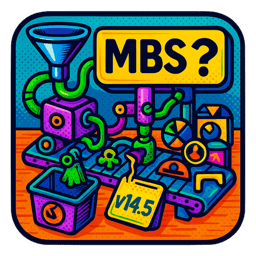

- TOC
{:toc}



# {{page.title}}

{{page.strapline}}


FileMaker code in.

↓

{: .w-128}

↓

Min. MBS version out.
<section>{{ explanation | markdownify }}</section>{: .side-note .text-center}

This little utility helps you find out which version of MBS Plugin you need for your code - and it's pretty flexible!

## What Version of MBS does this code need?

You can feed it

- a single `MBS ( "function" )` call
- an entire calculation
- a whole script text, for example copied straight from the [MBS website](https://www.mbsplugins.eu/XLBookAddConditionalFormat.shtml)

You can even feed it…

- script clipboard XML
  - just copy the scripts you want to check
  - the insert button will automatically convert to XML for you
- a dump of the *entire* database
  - as Save as XML
  - or as DDR

Yes! You can discover the minimum MBS version *for an entire solution* in moments!

### What MBS functions are used in this code?

Click the little (i) button.

### Are the MBS functions compatible with my OS?

Incompatible functions are shown in the list in red.

## MBS Functions List

fmMBSChecker also has a neat list of all MBS functions and the versions they were introduced in, including popup help and links to the documentation.

### Get + Check MBS function documentation in-app

An now you can instantly copy and check MBS example code from the MBS website in 3 clicks

### Update now

Plus there's an [Update now] button to update the list automatically from the MBS website, giving you access to the new functions as soon as a new version is released.

😎 nice!
