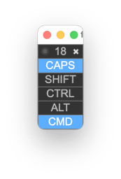

- TOC
{:toc}



# {{page.title}}

{{page.strapline}}

## Problem - Sticky Remote Keys

Have you ever had the problem when working remotely that your keyboard goes crazy, and it turns out that one of your modifier keys is stuck? (virtually not physically, of course, but still very annoying).

## Solution - fmModifierKeys

{: .float-front-right}

Well, now you can **see which modifier keys are stuck** with fmModifierKeys.

The number at the top shows you the value of Get( ActiveModifierKeys ), and pressed keys are highlighted.

{: .note}
Hot Tip: When a modifier key gets stuck you can usually release it by tapping the key again once or twice.
