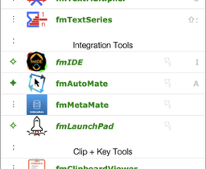

[{: .mrw-github-corner}]({{page.github_latest}})

- TOC
{:toc}



# {{page.title}}

{{page.strapline}}

{: .float-front-right .w-20pc}

## A free toolbox

full of power tools for FileMaker developers.

Whether you are a beginner or an experienced developer, fmWorkMate surely has a tool to help your development experience.

- Need to rename variables in scripts?
  - Use `fmCheckMate`'s Find and Replace functionality
- Fed up of errors due to broken pasted code?
  - Use `fmLogAnalyser` to check and fix your pasted code
- Want to transfer code between computers?
  - Use `fmCheckMate`'s Convert-&-Transfer Mode to quickly beam code between computers
- Want to quickly check your layout for potential issues?
  - Install the `fmCheckMate-XSLT` library and use `fmCheckMate`'s Layout Analysis feature.

{: .float-front-right .w-48}

See [Solutions to Daily Problems](solutions-to-daily-problems.html) for more common problems and how to solve them using fmWorkMate & co.

## Installation and Setup

[Install fmWorkMate] to get access to a variety of useful tools right inside FileMaker Pro.

[Setup fmWorkMate] to target the FileMaker you use and work in the mode which fits your task.

## Getting started

Once you have [installed and set up fmWorkMate](#installation-and-setup), you can use the toolbox tools right away.

From the indicator to the left of a tool you can see whether it is part of the toolbox `⋮`, an  installed `✦` or missing `✧` external tool, or a group heading `:`:

To open a tool, just click on its name, or press the corresponding shortcut key, if available.

## The Tools

The tools in fmWorkMate are grouped under various headings:

- [Developer Tools]
- [Text Tools]
- [Integration Tools]
- [Clip + Key Tools]
- [Setup Utilities]
- [More Utilities]

mrwMarkdownLinks
[Developer Tools]: developer-tools.html
[Install fmWorkMate]: install-fmworkmate.html
[Integration Tools]: integration-tools.html
[More Utilities]: more-utilities.html
[Setup fmWorkMate]: setup-fmworkmate.html
[Setup Utilities]: setup-utilities.html
[Text Tools]: text-tools.html
