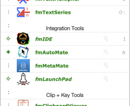
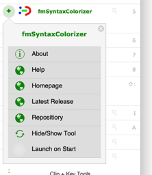

[{: .mrw-github-corner}]({{page.github_latest}})

- TOC
{:toc}



# {{page.title}}

{{page.strapline}}

{: .float-front-right .w-20pc}

## A free toolbox

full of power tools for FileMaker developers.

Whether you are a beginner or an experienced developer, fmWorkMate surely has a tool to help your development experience.

- Need to rename variables in scripts?
  - Use `fmCheckMate`'s Find and Replace functionality
- Fed up of errors due to broken pasted code?
  - Use `fmLogAnalyser` to check and fix your pasted code
- Want to transfer code between computers?
  - Use `fmCheckMate`'s Convert-&-Transfer Mode to quickly beam code between computers
- Want to quickly check your layout for potential issues?
  - Install the `fmCheckMate-XSLT` library and use `fmCheckMate`'s Layout Analysis feature.

{: .float-front-right .w-48}

See [Solutions to Daily Problems](solutions-to-daily-problems.html) for more common problems and how to solve them using fmWorkMate & co.

## Installation and Setup

[Install fmWorkMate] to get access to a variety of useful tools right inside FileMaker Pro.

[Setup fmWorkMate] to target the FileMaker you use and work in the mode which fits your task.

## Getting started

Once you have [installed and set up fmWorkMate](#installation-and-setup), you can use the toolbox tools right away.

{: .float-front-right .w-48}

**TL;DR:** Skip the rest and [jump start] your experience to get started quick.

From the indicator to the left of a tool you can see whether

- `:` the entry is a group of tools
- `⋮` the tool is part of the fmWorkMate toolbox
- `✧` the tool is an external tool but missing
- `✦` the tool is an external tool and present

To open a tool, just click on its name, or, if available, press the corresponding shortcut key (<kbd>⌘</kbd> + the key(s) shown faintlyon the right).

### Discovering and downloading other tools

Use the icon to the left of the tool to open the tool menu:

- `About`Open a short description of the tool with links to the documentation and the GitHub repo
- `Help` Open the fmWorkmate.com help page for the tool
- `Homepage` Open the fmWorkmate.com homepage for the tool
- `Latest Release` Open the GitHub releases page to download the latest version of the tool
- `Repository` Open the tool's GitHub repository page
- `Hide/Show Tool` You can hide the tool here if you don't need it. (Good luck getting it back though!)
- `Launch on Start` Use with fmLogAnalyser and the `Bug Off!` Alarm to catch errors as you make them.

## The Tools

The tools in fmWorkMate are grouped under various headings:

- [Developer Tools]
- [Text Tools]
- [Integration Tools]
- [Clip and Key Tools]
- [Setup Utilities]
- [More Utilities]

For an A-Z list of all tools, see the [Help Page](help.html), or use the search function.

mrwMarkdownLinks
[Clip and Key Tools]: clip-and-key-tools.html
[Developer Tools]: developer-tools.html
[Install fmWorkMate]: install-fmworkmate.html
[Integration Tools]: integration-tools.html
[jump start]: jump-start.html
[More Utilities]: more-utilities.html
[Setup fmWorkMate]: setup-fmworkmate.html
[Setup Utilities]: setup-utilities.html
[Text Tools]: text-tools.html
