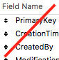
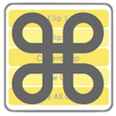
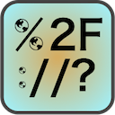

- TOC
{:toc}



### {{page.title}}

{{page.strapline}}

Well done! You made it to the help page!

And I, at last, *made* the help page!

Amazing!



> 🔍 Know what you are looking for?

- Try the search box at the top of the page to search fmWorkMate.com
- or choose the tool / topic from the A-Z page contents →
- or use the ← navigation to browse the structured site contents

<section class="fullwidth mrw-orange-bg">{{ search | markdownify }}</section>



> 📖 Learn by reading?

- Try starting  with our [FAQ](faq.html),
- or read [MrWatson's Solutions to daily FileMaker Problems](solutions-to-daily-problems.html)
- or checkout the blog on [mrwatson.de](https://www.mrwatson.de) for more in-depth articles

<section class="fullwidth mrw-schwarz-bg">{{ read | markdownify }}</section>



> 📽️ Prefer to learn by watching?

- Checkout my [Training Videos Page](videos.html)
- There's a few videos on the [fmWorkMate You Tube Channel](https://www.youtube.com/@fmworkmate34)

<section class="fullwidth mrw-red-bg">{{ watch | markdownify }}</section>



> 🤹 Or perhaps learning by doing?

- Try [jump starting your FileMaker development](jump-start.html) with hands-on fmWorkMate

<section class="fullwidth mrw-gold-bg">{{ do | markdownify }}</section>

> 💡 Or perhaps you know what you want to do

- but [don't know how](if-you-want-to.html)? 🧐



> 🌌 Are you lacking the big picture? 

- Take a look at how MrWatson's Tools work together as [a system of integrated tools](a-system-of-integrated-tools.html)
- Check out the [Case Study: Backporting an e-Invoice Solution for GBS GmbH](case-study-backporting-e-invoice-solution-gbs.html) for a real-world example of how fmWorkMate & co. worked together to solve a bunch of problems.

<section class="fullwidth mrw-green-bg">{{ big-picture | markdownify }}</section>



> 😃 Just need somebody to talk to?

Some tips from the Beatles:

> *"I need somebody, Help!"*
  
- 💬 Try the [fmWorkMate discussions](https://github.com/mrwatson-de/fmWorkMate/discussions) centre

> *"Not just anybody, Help!"*

- 🗣️ Or try [MrWatson's Slack Channel](https://join.slack.com/t/mrwatson-de/shared_invite/zt-ny8cfqhg-D5~X6HsZMspv~esuOwHHBg) for a slightly more cosy chat?

> *"You know I need someone, Help!"*

- 📧 for an unusual level of direct support try *dropping MrWatson a line* at russell[at]mrwatson.de

<section class="fullwidth">{{ interact | markdownify }}</section>

---

{:.float-front-right .mt-16 .w-64}

## FileMakerDoc

About [FileMakerDoc](filemakerdoc.html)

[🔝](#)

---

{:.float-front-right .mt-16 .w-64}

## fmAutoMate

About [fmAutoMate](fmautomate.html)

[🔝](#)

---

{:.float-front-right .mt-16 .w-64}

## fmCheckMate

About [fmCheckMate](fmcheckmate.html)

[🔝](#)

---

{:.float-front-right .mt-16 .w-64}

## fmCheckmate-XSLT

About [fmCheckmate-XSLT](fmcheckmate-xslt.html)

[🔝](#)

---

{:.float-front-right .mt-16 .w-64}

## fmClipboardViewer

About [fmClipboardViewer](fmclipboardviewer.html)

[🔝](#)

---

{:.float-front-right .mt-16 .w-64}

## fmDBAnalyser

About [fmDBAnalyser](fmdbanalyser.html)

[🔝](#)

---

{:.float-front-right .mt-16 .w-64}

## fmIDE

About [fmIDE](fmide.html)

[🔝](#)

---

{:.float-front-right .mt-16 .w-64}

## fmKillDefaultFields

About [fmKillDefaultFields](fmkilldefaultfields.html)

[🔝](#)

---

{:.float-front-right .mt-16 .w-64}

## fmLatencyMeter

About [fmLatencyMeter](fmlatencymeter.html)

[🔝](#)

---

{:.float-front-right .mt-16 .w-64}

## fmLaunchPad

About [fmLaunchPad](fmlaunchpad.html)

[🔝](#)

---

{:.float-front-right .mt-16 .w-64}

## fmLogAnalyser

About [fmLogAnalyser](fmloganalyser.html)

[🔝](#)

---

{:.float-front-right .mt-16 .w-64}

## fmMetaMate

About [fmMetaMate](fmmetamate.html)

[🔝](#)

---

{:.float-front-right .mt-16 .w-64}

## fmModifierKeys

About [fmModifierKeys](fmmodifierkeys.html)

[🔝](#)

---

{:.float-front-right .mt-16 .w-64}

## fmPasteMate

About [fmPasteMate](fmpastemate.html)

[🔝](#)

---

{:.float-front-right .mt-16 .w-64}

## fmPluginInfo

About [fmPluginInfo](fmplugininfo.html)

[🔝](#)

---

{:.float-front-right .mt-16 .w-64}

## fmPluginMate

About [fmPluginMate](fmpluginmate.html)

[🔝](#)

---

{:.float-front-right .mt-16 .w-64}

## fmScriptWorkspace

About [fmScriptWorkspace](fmscriptworkspace.html)

[🔝](#)

---

{:.float-front-right .mt-16 .w-64}

## fmSetupAssistant

About [fmSetupAssistant](fmsetupassistant.html)

[🔝](#)

---

{:.float-front-right .mt-16 .w-64}

## fmSimpleCalculator

About [fmSimpleCalculator](fmsimplecalculator.html)

[🔝](#)

---

{:.float-front-right .mt-16 .w-64}

## fmSyntaxColorizer

About [fmSyntaxColorizer](fmsyntaxcolorizer.html)

[🔝](#)

---

{:.float-front-right .mt-16 .w-64}

## fmTextConverter

About [fmTextConverter](fmtextconverter.html)

[🔝](#)

---

{:.float-front-right .mt-16 .w-64}

## fmTextDiff

About [fmTextDiff](fmtextdiff.html)

[🔝](#)

---

{:.float-front-right .mt-16 .w-64}

## fmTouchBar

About [fmTouchBar](fmtouchbar.html)

[🔝](#)

---

{:.float-front-right .mt-16 .w-64}

## fmTextMultiplier

About [fmTextMultiplier](fmtextmultiplier.html)

[🔝](#)

---

{:.float-front-right .mt-16 .w-64}

## fmTextSeries

About [fmTextSeries](fmtextseries.html)

[🔝](#)

---

{:.float-front-right .mt-16 .w-64}

## fmThings

About [fmThings](fmthings.html)

[🔝](#)

---

{:.float-front-right .mt-16 .w-64}

## fmUrlDecode

About [fmUrlDecode](fmurldecode.html)

[🔝](#)

---

{:.float-front-right .mt-16 .w-64}

## fmWorkMate

About the [fmWorkMate](fmworkmate.html) toolbox 

[🔝](#)

---

{:.float-front-right .mt-16 .w-64}

## fmWorkMate Clip and Key Tools

About [fmWorkMate Clip and Key Tools](clip-and-key-tools.html)

[🔝](#)

---

{:.float-front-right .mt-16 .w-64}

## fmWorkMate Developer Tools

About [fmWorkMate Developer Tools](developer-tools.html)

[🔝](#)

---

{:.float-front-right .mt-16 .w-64}

## fmWorkMate Integration Tools

About [fmWorkMate Integration Tools](integration-tools.html)

[🔝](#)

---

{:.float-front-right .mt-16 .w-64}

## fmWorkMate More Utilities

About [fmWorkMate More Utilities](more-utilities.html)

[🔝](#)

---

{:.float-front-right .mt-16 .w-64}

## fmWorkMate Setup Utilities

About [fmWorkMate Setup Utilities](setup-utilities.html)

[🔝](#)

---

{:.float-front-right .mt-16 .w-64}

## fmWorkMate Text Tools

About [fmWorkMate Text Tools](text-tools.html)

[🔝](#)

---

{:.float-front-right .mt-16 .h-64}

## MrWatson's tools

About [MrWatson's tools](mrwatsons-tools.html)

[🔝](#)

---

{:.float-front-right .mt-16 .w-64}

## myMateJson

About [myMateJson](mymatejson.html)

[🔝](#)
