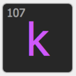

- TOC
{:toc}



# {{page.title}}

{{page.strapline}}

{: .fullwidth .mrw-schwarz-bg}
This page is on it's way … bit by bit.

{: .float-front-right .w-64}

## fmWorkMate

Once you have [Installed and setup fmWorkMate](fmworkmate.html#installation-and-setup) there are some cool things you can do

- Rename things in your code using [fmCheckMate's Find & Replace](fmcheckmate.html##finding--replacing-textFinding & Replacing Text)
  - For example: in your scripts [rename variables with fmCheckMate]
- Use [fmTextMultiplier] to [Multiply your Code]
- Use [fmTextConverter] to [Recontextualise Code]

{: .note}
Need to copy code to/from another computer?

{: .float-front-right .w-64}

- You can [transfer code across the ether with fmCheckMate]

{: .note}
Building an **OnKey trigger script** but **can't remember the codes** for <kbd>←</kbd>, <kbd>→</kbd>, <kbd>␛</kbd> & co.?

{: .float-front-right .w-64}

- Use [fmKeyPress] to get the codes quickly

{: .note}
Working remotely and the modifier keys seem to be sticking?

{: .float-front-right .w-64}

- Check it out with [fmModifierKeys]

{: .float-front-right .w-64}

## fmSyntaxColorizer

Want to catch more bugs during development?

- [Install fmSyntaxColorizer] to brighten up your code with **semantic** step colours.



### Play

…TODO

<section class="fullwidth mrw-green-bg">{{ fmworkmate | markdownify }}</section>

{: .float-front-right .w-64} 

## Pimp your fmWorkMate with fmCheckMate-XSLT

1. Download - [from GitHub](https://github.com/mrwatson-de/fmCheckMate-XSLT/releases/latest)
2. Install - the fmCheckmate folder into your Documents folder
3. Transform - your work!



### Play

Ready for Some fun?
…

<section class="fullwidth mrw-orange-bg">{{ fmcheckmate_xslt | markdownify }}</section>

## fmSyntaxColorizer

1. Download - by clicking on fmSyntaxColorizer in fmWorkMate.
2. Install - as a folder next to the fmWorkmate folder
3. Integrate - by opening and clicking [Colorize!]



### Play

Ready for Some fun?
…

<section class="fullwidth mrw-blue-bg">{{ fmsyntaxcolorizer | markdownify }}</section>

## fmAutoMate

1. Download - by clicking on fmAutoMate in fmWorkMate.
2. Install - as a folder next to the fmWorkmate folder
3. Integrate - by opening and clicking [fmAutoMate]



### Play

Ready for Some fun?
…

<section class="fullwidth mrw-red-bg">{{ fmautomate | markdownify }}</section>

## fmIDE

1. Download - by clicking on fmIDE in fmWorkMate.
2. Install - by copying the fmIDE Script into each solution file
3. Allow - make sure fmpurls are allowed for developers
4. Season to taste - by copying the fmIDE Script into each solution file



### Play

Ready for Some fun?

- Open a file in FileMaker Pro in full-access / developer mode
- Copy the following url into your browser, adjusting the filename and scriptname as needed(*) and press return

      fmp://$/«filename»?script=fmIDE&$script_name=«scriptname»&$script_step_number=12`
  
  - (*) Note: You may have to escape any special characters for urls (e.g. spaces are %20)

<section class="fullwidth fmide-bg">{{ fmide | markdownify }}</section>

## fmLaunchPad

Tired of fmWorkMate files being mixed up with your database files?

Create an extra App and use fmLaunchPad to launch your fmWorkMate files separately.

1. Download
2. Install
3. Setup



### Play

Ready for Some fun?
…

<section class="fullwidth schawarz-bg">{{ fmlaunchpad | markdownify }}</section>

mrwMarkdownLinks
[fmAutoMate]: fmautomate.html
[fmKeyPress]: fmkeypress.html
[fmModifierKeys]: fmmodifierkeys.html
[fmSyntaxColorizer]: fmsyntaxcolorizer.html
[fmTextConverter]: fmtextconverter.html
[fmTextMultiplier]: fmtextmultiplier.html
[Install fmSyntaxColorizer]: install-fmsyntaxcolorizer.html
[Install fmWorkMate]: install-fmworkmate.html
[Multiply your Code]: multiply-your-code.html
[Recontextualise Code]: recontextualise-code.html
[rename variables with fmCheckMate]: rename-variables-with-fmcheckmate.html
[transfer code across the ether with fmCheckMate]: transfer-code-across-the-ether-with-fmcheckmate.html
