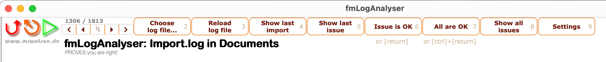

- TOC
{:toc}



# {{page.title}}

{{page.strapline}}

MrWatson's tools are all pressed from the same mould. That means

{: .mrw-gold-bg}
once you know one tool, you quickly feel at home in all of them!

The most common features are described here.

## The App Menu

Each tool has an `«App»` menu, containing the most important functions of the tool:

You'll probably recognise the app menu as the traditional FileMaker `Script` menu, home to the traditional script shortcut keys (and variations thereof).

<kbd>⌘</kbd>{:.float-front-right}

### Standard App Keyboard Shortcuts

These are the standard keyboard shortcuts in MrWatson's tools:

#### App Menu

<kbd>⌘</kbd><kbd>1</kbd>
: **Home** / Go Back / Continue

<kbd>⌘</kbd><kbd>2</kbd>--<kbd>⌘</kbd><kbd>8</kbd>
: The **most important functions in the tool**.

<kbd>⌘</kbd><kbd>9</kbd>
: Open the **settings**.

#### Window Menu

<kbd>⌘</kbd><kbd>0</kbd>
: **Maximize/minimize/reset the window**

<kbd>⇧</kbd><kbd>⌘</kbd><kbd>W</kbd>
: **Hide the window**

<kbd>⌘</kbd><kbd>W</kbd>
: **Close the window**

## Navigation

Navigation in MrWatson's tools is hierarchical.

<kbd>⌘ •</kbd>{: .float-front-right .mt-16 .w-32 .h-32}

### Navigate Forwards

Select a menu item or click a button in the layout to navigate forwards in the hierarchy.

<kbd>⌘ 1</kbd>{: .float-front-right .mt-16 .w-32 .h-32}

### Navigate Home / Back

Wherever you are in the tools you can go back (towards) home in any of these ways:

<kbd>⌘</kbd><kbd>1</kbd>
: Press <kbd>⌘</kbd><kbd>1</kbd>

<kbd>App Menu > Home</kbd>
: Select Home from the App Menu

{: width="24px"}
: Click the mini back button in the top left of the layout

{: .w-32}
: Click the logo in the top left of the layout

## Shortcut Keys

### Shortcut Key Hints

{:.mrw-gold-bg}

👀 Keep your eyes open for little grey shortcut key hints on buttons in the layout.

They show just the number (or letter) and any modifier keys - but _without_ the command key.

In some tools, like [fmLogAnalyser], the shortcut keys correspond to the action buttons across the top of layout:

### fmWorkMate Tool Keys

 Keyboard shortcuts - and moreover the order of tools in the toolbox - have been carefully chosen to make it easier to memorise the keyboard shortcuts:

| Tool               | Key | Mnemonic (in German = Eselbrücke / donkey bridge)           |
|--------------------|:---:|------------------------------------------------------------ |
| fmCheckMate        |  ⌘2 | The most important tool takes first place in the tool list  |
| fmLogAnalyser      |  ⌘3 | Follows fmCheckmate [functionally](did-that-just-break.html) and physically in the list |
| fmDBAnalyser       |  ⌘4 | The analyser tools are together in the list                 |
| fmSyntaxColorizer  |  ⌘5 | The last of the original developer tools                    |
|--------------------|-----|------------------------------------------------------------ |
| fmTextConverter    |  ⌘6 | You often need to convert code before you diff (= 7-1)      |
| fmTextDiff         |  ⌘7 | SHIFT-**7** is a DIVIDE (/) symbol (on a US/UK/DE keyboard) |
| fmTextMultiplier   |  ⌘8 | SHIFT-**8** is a MULTIPLY (*) symbol (on a German keyboard) |
| fmTextSeries       | ⌘⇧: | Dots of the colon = dots in the `from..to` series           |
|--------------------|-----|------------------------------------------------------------ |
| fmAutomMate        |  ⌘A | A for **A**utomate                                          |
| fmPasteMate        |  ⌘P | P for **P**asteMate                                         |
| myMateJSON         |  ⌘J | J for **J**SON                                              |
| fmSimpleCalculator | ⌘⇧= | = for Calculate                                             |
|--------------------|-----|------------------------------------------------------------ |

### fmWorkMate Killer Keys

fmWorkMate is optimised for speed and productivity so that (for most tools)…

{: .mrw-killer-bg}
the same key is used to open the tool as to trigger the tool's main function

In other words from fmWorkMate you can just press a key twice to open and use the tool:

<kbd>⌘</kbd><kbd>2</kbd> + <kbd>⌘</kbd><kbd>2</kbd>
: Open [fmCheckmate] and `Convert the Clipboard`

<kbd>⌘</kbd><kbd>3</kbd> + <kbd>⌘</kbd><kbd>3</kbd>
: Open [fmLogAnalyser] and `Reload the Log`

<kbd>⌘</kbd><kbd>4</kbd> + <kbd>⌘</kbd><kbd>4</kbd>
: Open [fmDBAnalyser] and `Analyse Relationships`

<kbd>⌘</kbd><kbd>5</kbd> + <kbd>⌘</kbd><kbd>5</kbd>
: Open [fmSyntaxColorizer] and `Colorize your Code`

<kbd>⌘</kbd><kbd>6</kbd> + <kbd>⌘</kbd><kbd>6</kbd>
: Open [fmTextConverter] and  `FM → Convert → FM` (convert FileMaker objects on the clipboard)

<kbd>⌘</kbd><kbd>7</kbd> + <kbd>⌘</kbd><kbd>7</kbd>
: Open [fmTextDiff] and `Paste Text and Diff automatically`

<kbd>⌘</kbd><kbd>8</kbd> + <kbd>⌘</kbd><kbd>8</kbd>
: Open [fmTextMultiplier] and `FM → Multiply → FM` \
(multiply the FileMaker objects on the clipboard)

{: .float-front-right .w-64}

### Shortcut Keys for Windows Users

{: .mrw-golden-rule}

Windows users must take ctrl where Mac users take command

MrWatson's Tools and documentation take a Mac-first approach, and thus keyboard shortcuts are shown for the Mac platform - with the <kbd>⌘</kbd> command key.

That means, of course - unless the windows shortcut is completely different & separately documented -

{: .mrw-mac-bg}

{: .mrw-windows-bg}
windows users will need to use the <kbd>⌃</kbd> ctrl key instead of the <kbd>⌘</kbd> command key.

### Shortcuts Galore

See [MrWatson's Keyboard Shortcut Cheatsheet] for more keyboard shortcuts and tricks.

mrwMarkdownLinks
[fmCheckmate]: fmcheckmate.html
[fmDBAnalyser]: fmdbanalyser.html
[fmLogAnalyser]: fmloganalyser.html
[fmSyntaxColorizer]: fmsyntaxcolorizer.html
[fmTextConverter]: fmtextconverter.html
[fmTextDiff]: fmtextdiff.html
[fmTextMultiplier]: fmtextmultiplier.html
[MrWatson's Keyboard Shortcut Cheatsheet]: mrwatsons-keyboard-shortcut-cheatsheet.html
