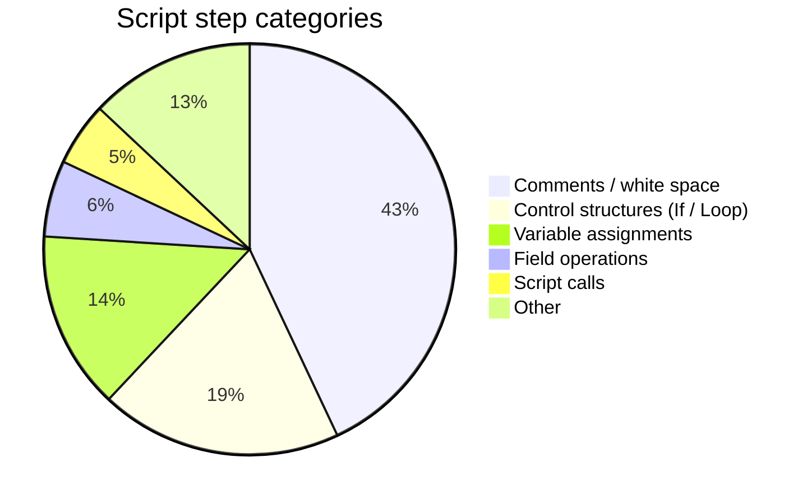

- TOC
{:toc}



# {{page.title}}

{{page.strapline}}

AI produced, so no guarantees here!

## Script Steps by ID

| Step ID | Step Name                             | Notes |
|:-------:|:--------------------------------------|:------|
| 1       | Perform Script                        |       |
| 2       | `<unknown>`                           |       |
| 3       | Save a Copy as XML                    |       |
| 4       | Go to Next Field                      |       |
| 5       | Go to Previous Field                  |       |
| 6       | Go to Layout                          |       |
| 7       | New Record/Request                    |       |
| 8       | Duplicate Record/Request              |       |
| 9       | Delete Record/Request                 |       |
| 10      | Delete All Records                    |       |
| 11      | Insert from Index                     |       |
| 12      | Insert from Last Visited              |       |
| 13      | Insert Current Date                   |       |
| 14      | Insert Current Time                   |       |
| 15      | `<unknown>`                           |       |
| 16      | Go to Record/Request/Page             |       |
| 17      | Go to Field                           |       |
| 18      | Check Selection                       |       |
| 19      | Check Record                          |       |
| 20      | Check Found Set                       |       |
| 21      | Unsort Records                        |       |
| 22      | Enter Find Mode                       |       |
| 23      | Show All Records                      |       |
| 24      | Modify Last Find                      |       |
| 25      | Omit Record                           |       |
| 26      | Omit Multiple Records                 |       |
| 27      | Show Omitted Only                     |       |
| 28      | Perform Find                          |       |
| 29      | Show/Hide Toolbars                    |       |
| 30      | View As                               |       |
| 31      | Adjust Window                         |       |
| 32      | Open Help                             |       |
| 33      | Open File                             |       |
| 34      | Close File                            |       |
| 35      | Import Records                        |       |
| 36      | Export Records                        |       |
| 37      | Save a Copy as                        |       |
| 38      | Open Manage Database                  |       |
| 39      | Sort Records                          |       |
| 40      | Relookup Field Contents               |       |
| 41      | Enter Preview Mode                    |       |
| 42      | Print Setup                           |       |
| 43      | Print                                 |       |
| 44      | Exit Application                      |       |
| 45      | Undo/Redo                             |       |
| 46      | Cut                                   |       |
| 47      | Copy                                  |       |
| 48      | Paste                                 |       |
| 49      | Clear                                 |       |
| 50      | Select All                            |       |
| 51      | Revert Record/Request                 |       |
| 52      | `<unknown>`                           |       |
| 53      | `<unknown>`                           |       |
| 54      | `<unknown>`                           |       |
| 55      | Enter Browse Mode                     |       |
| 56      | Insert Picture                        |       |
| 57      | Send Event                            |       |
| 58      | `<unknown>`                           |       |
| 59      | Insert QuickTime                      |       |
| 60      | Insert Current User Name              |       |
| 61      | Insert Text                           |       |
| 62      | Pause/Resume Script                   |       |
| 63      | Send Mail                             |       |
| 64      | Send DDE Execute                      |       |
| 65      | Dial Phone                            |       |
| 66      | Speak                                 |       |
| 67      | Perform AppleScript                   |       |
| 68      | If                                    |       |
| 69      | Else                                  |       |
| 70      | End If                                |       |
| 71      | Loop                                  |       |
| 72      | Exit Loop If                          |       |
| 73      | End Loop                              |       |
| 74      | Go to Related Record                  |       |
| 75      | Commit Records/Requests               |       |
| 76      | Set Field                             |       |
| 77      | Insert Calculated Result              |       |
| 78      | Insert Object                         |       |
| 79      | Freeze Window                         |       |
| 80      | Refresh Window                        |       |
| 81      | Scroll Window                         |       |
| 82      | New File                              |       |
| 83      | Change Password                       |       |
| 84      | Set Multi-User                        |       |
| 85      | Allow User Abort                      |       |
| 86      | Set Error Capture                     |       |
| 87      | Show Custom Dialog                    |       |
| 88      | Open Script Workspace                 |       |
| 89      | # (comment)                           |       |
| 90      | Halt Script                           |       |
| 91      | Replace Field Contents                |       |
| 92      | Show/Hide Text Ruler                  |       |
| 93      | Beep                                  |       |
| 94      | Set Use System Formats                |       |
| 95      | Recover File                          |       |
| 96      | Save a Copy as Add-on Package         |       |
| 97      | Set Zoom Level                        |       |
| 98      | Copy All Records/Requests             |       |
| 99      | Go to Portal Row                      |       |
| 100     | `<unknown>`                           |       |
| 101     | Copy Record/Request                   |       |
| 102     | Flush Cache to Disk                   |       |
| 103     | Exit Script                           |       |
| 104     | Delete Portal Row                     |       |
| 105     | Open Preferences                      |       |
| 106     | Correct Word                          |       |
| 107     | Spelling Options                      |       |
| 108     | Select Dictionaries                   |       |
| 109     | Edit User Dictionary                  |       |
| 111     | Open URL                              |       |
| 112     | Open Manage Value Lists               |       |
| 113     | Open Sharing                          |       |
| 114     | Open File Options                     |       |
| 115     | Allow Formatting Bar                  |       |
| 116     | Set Next Serial Value                 |       |
| 117     | Execute SQL                           |       |
| 118     | Open Hosts                            |       |
| 119     | Move/Resize Window                    |       |
| 120     | Arrange All Windows                   |       |
| 121     | Close Window                          |       |
| 122     | New Window                            |       |
| 123     | Select Window                         |       |
| 124     | Set Window Title                      |       |
| 125     | Else If                               |       |
| 126     | Constrain Found Set                   |       |
| 127     | Extend Found Set                      |       |
| 128     | Perform Find/Replace                  |       |
| 129     | Open Find/Replace                     |       |
| 130     | Set Selection                         |       |
| 131     | Insert File                           |       |
| 132     | Export Field Contents                 |       |
| 133     | Open Record/Request                   |       |
| 134     | Add Account                           |       |
| 135     | Delete Account                        |       |
| 136     | Reset Account Password                |       |
| 137     | Enable Account                        |       |
| 138     | Re-Login                              |       |
| 139     | Convert File                          |       |
| 140     | Open Manage Data Sources              |       |
| 141     | Set Variable                          |       |
| 142     | Install Menu Set                      |       |
| 143     | Save Records as Excel                 |       |
| 144     | Save Records as PDF                   |       |
| 145     | Go to Object                          |       |
| 146     | Set Web Viewer                        |       |
| 147     | Set Field By Name                     |       |
| 148     | Install OnTimer Script                |       |
| 149     | Open Edit Saved Finds                 |       |
| 150     | Perform Quick Find                    |       |
| 151     | Open Manage Layouts                   |       |
| 152     | Save Records as Snapshot Link         |       |
| 153     | `<unknown>`                           |       |
| 154     | Sort Records by Field                 |       |
| 155     | Find Matching Records                 |       |
| 156     | Open Manage Containers                |       |
| 157     | Install Plug-In File                  |       |
| 158     | Insert PDF                            |       |
| 159     | Insert Audio/Video                    |       |
| 160     | Insert from URL                       |       |
| 161     | Insert from Device                    |       |
| 162     | `<unknown>`                           |       |
| 163     | `<unknown>`                           |       |
| 164     | Perform Script on Server              |       |
| 165     | Open Manage Themes                    |       |
| 166     | Show/Hide Menubar                     |       |
| 167     | Refresh Object                        |       |
| 168     | Set Layout Object Animation           |       |
| 169     | Close Popover                         |       |
| 170     | `<unknown>`                           |       |
| 171     | `<unknown>`                           |       |
| 172     | Open Upload to Host                   |       |
| 173     | `<unknown>`                           |       |
| 174     | Enable Touch Keyboard                 |       |
| 175     | Perform JavaScript in Web Viewer      |       |
| 176     | Set Allowed Orientations              |       |
| 177     | AVPlayer Play                         |       |
| 178     | AVPlayer Set Playback State           |       |
| 179     | AVPlayer Set Options                  |       |
| 180     | Refresh Portal                        |       |
| 181     | Get Folder Path                       |       |
| 182     | Truncate Table                        |       |
| 183     | Open Favorites                        |       |
| 184     | Open Starter Solution                 |       |
| 185     | Configure Region Monitor Script       |       |
| 186     | MBS                                   |       |
| 187     | Configure Local Notification          |       |
| 188     | Get File Exists                       |       |
| 189     | Get File Size                         |       |
| 190     | Create Data File                      |       |
| 191     | Open Data File                        |       |
| 192     | Write to Data File                    |       |
| 193     | Read from Data File                   |       |
| 194     | Get Data File Position                |       |
| 195     | Set Data File Position                |       |
| 196     | Close Data File                       |       |
| 197     | Delete File                           |       |
| 198     | `<unknown>`                           |       |
| 199     | Rename File                           |       |
| 200     | Set Error Logging                     |       |
| 201     | Configure NFC Reading                 |       |
| 202     | Configure Machine Learning Model      |       |
| 203     | Execute FileMaker Data API            |       |
| 205     | Open Transaction                      |       |
| 206     | Commit Transaction                    |       |
| 207     | Revert Transaction                    |       |
| 208     | Set Session Identifier                |       |
| 209     | Set Dictionary                        |       |
| 210     | Perform Script on Server with Callback|       |
| 211     | Trigger Claris Connect Flow           |       |
| 212     | `<unknown>`                           |       |
| 213     | `<unknown>`                           |       |
| 214     | `<unknown>`                           |       |
| 215     | `<unknown>`                           |       |
| 216     | `<unknown>`                           |       |
| 217     | `<unknown>`                           |       |
| 218     | `<unknown>`                           |       |
| 219     | `<unknown>`                           |       |
| 220     | `<unknown>`                           |       |
| 221     | `<unknown>`                           |       |

## Script Steps by Group

| Group         | Step Name                                 | Step ID | Notes |
|---------------|-------------------------------------------|---------|-------|
| Control       | Allow User Abort                          | 85      |       |
| Control       | Commit Transaction                        | 206     |       |
| Control       | Configure Local Notification              | 187     |       |
| Control       | Configure Machine Learning Model          | 202     |       |
| Control       | Configure NFC Reading                     | 201     |       |
| Control       | Configure Region Monitor Script           | 185     |       |
| Control       | Else                                      | 69      |       |
| Control       | Else If                                   | 125     |       |
| Control       | End If                                    | 70      |       |
| Control       | End Loop                                  | 73      |       |
| Control       | Exit Loop If                              | 72      |       |
| Control       | Exit Script                               | 103     |       |
| Control       | Halt Script                               | 90      |       |
| Control       | If                                        | 68      |       |
| Control       | Install OnTimer Script                    | 148     |       |
| Control       | Loop                                      | 71      |       |
| Control       | Open Transaction                          | 205     |       |
| Control       | Pause/Resume Script                       | 62      |       |
| Control       | Perform Script                            | 1       |       |
| Control       | Perform Script on Server                  | 164     |       |
| Control       | Perform Script on Server with Callback    | 210     |       |
| Control       | Revert Transaction                        | 207     |       |
| Control       | Set Error Capture                         | 86      |       |
| Control       | Set Error Logging                         | 200     |       |
| Control       | Set Layout Object Animation               | 168     |       |
| Control       | Set Variable                              | 141     |       |
| Control       | Trigger Claris Connect Flow               | 211     |       |
| Navigation    | Close Popover                             | 169     |       |
| Navigation    | Enter Browse Mode                         | 55      |       |
| Navigation    | Enter Find Mode                           | 22      |       |
| Navigation    | Enter Preview Mode                        | 41      |       |
| Navigation    | Go to Field                               | 17      |       |
| Navigation    | Go to Layout                              | 6       |       |
| Navigation    | Go to Next Field                          | 4       |       |
| Navigation    | Go to Object                              | 145     |       |
| Navigation    | Go to Portal Row                          | 99      |       |
| Navigation    | Go to Previous Field                      | 5       |       |
| Navigation    | Go to Record/Request/Page                 | 16      |       |
| Navigation    | Go to Related Record                      | 74      |       |
| Editing       | Clear                                     | 49      |       |
| Editing       | Copy                                      | 47      |       |
| Editing       | Cut                                       | 46      |       |
| Editing       | Paste                                     | 48      |       |
| Editing       | Perform Find/Replace                      | 128     |       |
| Editing       | Select All                                | 50      |       |
| Editing       | Set Selection                             | 130     |       |
| Editing       | Undo/Redo                                 | 45      |       |
| Fields        | Export Field Contents                     | 132     |       |
| Fields        | Insert Audio/Video                        | 159     |       |
| Fields        | Insert Calculated Result                  | 77      |       |
| Fields        | Insert Current Date                       | 13      |       |
| Fields        | Insert Current Time                       | 14      |       |
| Fields        | Insert Current User Name                  | 60      |       |
| Fields        | Insert File                               | 131     |       |
| Fields        | Insert from Device                        | 161     |       |
| Fields        | Insert from Index                         | 11      |       |
| Fields        | Insert from Last Visited                  | 12      |       |
| Fields        | Insert from URL                           | 160     |       |
| Fields        | Insert PDF                                | 158     |       |
| Fields        | Insert Picture                            | 56      |       |
| Fields        | Insert Text                               | 61      |       |
| Fields        | Relookup Field Contents                   | 40      |       |
| Fields        | Replace Field Contents                    | 91      |       |
| Fields        | Set Field                                 | 76      |       |
| Fields        | Set Field By Name                         | 147     |       |
| Fields        | Set Next Serial Value                     | 116     |       |
| Records       | Commit Records/Requests                   | 75      |       |
| Records       | Copy All Records/Requests                 | 98      |       |
| Records       | Copy Record/Request                       | 101     |       |
| Records       | Delete All Records                        | 10      |       |
| Records       | Delete Portal Row                         | 104     |       |
| Records       | Delete Record/Request                     | 9       |       |
| Records       | Duplicate Record/Request                  | 8       |       |
| Records       | Export Records                            | 36      |       |
| Records       | Import Records                            | 35      |       |
| Records       | New Record/Request                        | 7       |       |
| Records       | Open Record/Request                       | 133     |       |
| Records       | Revert Record/Request                     | 51      |       |
| Records       | Save Records as Excel                     | 143     |       |
| Records       | Save Records as PDF                       | 144     |       |
| Records       | Save Records as Snapshot Link             | 152     |       |
| Records       | Truncate Table                            | 182     |       |
| Found Sets    | Constrain Found Set                       | 126     |       |
| Found Sets    | Extend Found Set                          | 127     |       |
| Found Sets    | Find Matching Records                     | 155     |       |
| Found Sets    | Modify Last Find                          | 24      |       |
| Found Sets    | Omit Multiple Records                     | 26      |       |
| Found Sets    | Omit Record                               | 25      |       |
| Found Sets    | Perform Find                              | 28      |       |
| Found Sets    | Perform Quick Find                        | 150     |       |
| Found Sets    | Show All Records                          | 23      |       |
| Found Sets    | Show Omitted Only                         | 27      |       |
| Found Sets    | Sort Records                              | 39      |       |
| Found Sets    | Sort Records by Field                     | 154     |       |
| Found Sets    | Unsort Records                            | 21      |       |
| Windows       | Adjust Window                             | 31      |       |
| Windows       | Arrange All Windows                       | 120     |       |
| Windows       | Close Window                              | 121     |       |
| Windows       | Freeze Window                             | 79      |       |
| Windows       | Move/Resize Window                        | 119     |       |
| Windows       | New Window                                | 122     |       |
| Windows       | Refresh Window                            | 80      |       |
| Windows       | Scroll Window                             | 81      |       |
| Windows       | Select Window                             | 123     |       |
| Windows       | Set Window Title                          | 124     |       |
| Windows       | Set Zoom Level                            | 97      |       |
| Windows       | Show/Hide Menubar                         | 166     |       |
| Windows       | Show/Hide Text Ruler                      | 92      |       |
| Windows       | Show/Hide Toolbars                        | 29      |       |
| Windows       | View As                                   | 30      |       |
| Files         | Close Data File                           | 196     |       |
| Files         | Close File                                | 34      |       |
| Files         | Convert File                              | 139     |       |
| Files         | Create Data File                          | 190     |       |
| Files         | Delete File                               | 197     |       |
| Files         | Get Data File Position                    | 194     |       |
| Files         | Get File Exists                           | 188     |       |
| Files         | Get File Size                             | 189     |       |
| Files         | New File                                  | 82      |       |
| Files         | Open Data File                            | 191     |       |
| Files         | Open File                                 | 33      |       |
| Files         | Print                                     | 43      |       |
| Files         | Print Setup                               | 42      |       |
| Files         | Read from Data File                       | 193     |       |
| Files         | Recover File                              | 95      |       |
| Files         | Rename File                               | 199     |       |
| Files         | Save a Copy as                            | 37      |       |
| Files         | Save a Copy as XML                        | 3       |       |
| Files         | Set Data File Position                    | 195     |       |
| Files         | Set Multi-User                            | 84      |       |
| Files         | Set Use System Formats                    | 94      |       |
| Files         | Write to Data File                        | 192     |       |
| Accounts      | Add Account                               | 134     |       |
| Accounts      | Change Password                           | 83      |       |
| Accounts      | Delete Account                            | 135     |       |
| Accounts      | Enable Account                            | 137     |       |
| Accounts      | Re-Login                                  | 138     |       |
| Accounts      | Reset Account Password                    | 136     |       |
| Spelling      | Check Found Set                           | 20      |       |
| Spelling      | Check Record                              | 19      |       |
| Spelling      | Check Selection                           | 18      |       |
| Spelling      | Correct Word                              | 106     |       |
| Spelling      | Edit User Dictionary                      | 109     |       |
| Spelling      | Select Dictionaries                       | 108     |       |
| Spelling      | Set Dictionary                            | 209     |       |
| Spelling      | Spelling Options                          | 107     |       |
| Open Menu Item| Open Edit Saved Finds                     | 149     |       |
| Open Menu Item| Open Favorites                            | 183     |       |
| Open Menu Item| Open File Options                         | 114     |       |
| Open Menu Item| Open Find/Replace                         | 129     |       |
| Open Menu Item| Open Help                                 | 32      |       |
| Open Menu Item| Open Hosts                                | 118     |       |
| Open Menu Item| Open Manage Containers                    | 156     |       |
| Open Menu Item| Open Manage Data Sources                  | 140     |       |
| Open Menu Item| Open Manage Database                      | 38      |       |
| Open Menu Item| Open Manage Layouts                       | 151     |       |
| Open Menu Item| Open Manage Themes                        | 165     |       |
| Open Menu Item| Open Manage Value Lists                   | 112     |       |
| Open Menu Item| Open Preferences                          | 105     |       |
| Open Menu Item| Open Script Workspace                     | 88      |       |
| Open Menu Item| Open Sharing                              | 113     |       |
| Open Menu Item| Open Upload To Host                       | 172     |       |
| Miscellaneous | # (Comment)                               | 89      |       |
| Miscellaneous | Allow Formatting Bar                      | 115     |       |
| Miscellaneous | AVPlayer Play                             | 177     |       |
| Miscellaneous | AVPlayer Set Options                      | 179     |       |
| Miscellaneous | AVPlayer Set Playback State               | 178     |       |
| Miscellaneous | Beep                                      | 93      |       |
| Miscellaneous | Dial Phone                                | 65      |       |
| Miscellaneous | Enable Touch Keyboard                     | 174     |       |
| Miscellaneous | Execute FileMaker Data API                | 203     |       |
| Miscellaneous | Execute SQL                               | 117     |       |
| Miscellaneous | Exit Application                          | 44      |       |
| Miscellaneous | Flush Cache to Disk                       | 102     |       |
| Miscellaneous | Get Folder Path                           | 181     |       |
| Miscellaneous | Install Menu Set                          | 142     |       |
| Miscellaneous | Install Plug-In File                      | 157     |       |
| Miscellaneous | Open URL                                  | 111     |       |
| Miscellaneous | Perform AppleScript                       | 67      |       |
| Miscellaneous | Perform JavaScript in Web Viewer          | 175     |       |
| Miscellaneous | Refresh Object                            | 167     |       |
| Miscellaneous | Refresh Portal                            | 180     |       |
| Miscellaneous | Send DDE Execute                          | 64      |       |
| Miscellaneous | Send Event                                | 57      |       |
| Miscellaneous | Send Mail                                 | 63      |       |
| Miscellaneous | Set Session Identifier                    | 208     |       |
| Miscellaneous | Set Web Viewer                            | 146     |       |
| Miscellaneous | Show Custom Dialog                        | 87      |       |
| Miscellaneous | Speak                                     | 66      |       |

## Script steps by Frequency Ranking

This statistic was created using Advanter + Cross Check, from ~850K Script steps.

The results are, of course, very dependent on programming and documenting styles, nevertheless very illuminating!

- 43% comments / white space
- 19% control structures (If / Loop)
- 14% variable assignments
- 6% field operations
- 5% script calls
- 13% other stuff

| Frequency Rank | Step Name                              | Step ID | Frequency |
|----------------|----------------------------------------|---------|-----------|
| 1.             | # (comment)                            | 89      | 371931    |
| 2.             | Set Variable                           | 141     | 121115    |
| 3.             | End If                                 | 70      | 53020     |
| 4.             | If                                     | 68      | 53020     |
| 5.             | Set Field                              | 76      | 49900     |
| 6.             | Perform Script                         | 1       | 47316     |
| 7.             | Else If                                | 125     | 19964     |
| 8.             | Exit Script                            | 103     | 15542     |
| 9.             | Go to Layout                           | 6       | 15149     |
| 10.            | Commit Records/Requests                | 75      | 11911     |
| 11.            | Else                                   | 69      | 10272     |
| 12.            | Exit Loop If                           | 72      | 7101      |
| 13.            | Go to Record/Request/Page              | 16      | 6247      |
| 14.            | End Loop                               | 73      | 5471      |
| 15.            | Loop                                   | 71      | 5471      |
| 16.            | Enter Find Mode                        | 22      | 4649      |
| 17.            | Perform Find                           | 28      | 4208      |
| 18.            | Select Window                          | 123     | 3896      |
| 19.            | Sort Records                           | 39      | 3867      |
| 20.            | Set Error Capture                      | 86      | 3354      |
| 21.            | Enter Browse Mode                      | 55      | 2970      |
| 22.            | Replace Field Contents                 | 91      | 2555      |
| 23.            | Freeze Window                          | 79      | 2426      |
| 24.            | Allow User Abort                       | 85      | 2025      |
| 25.            | Go to Field                            | 17      | 1757      |
| 26.            | Show All Records                       | 23      | 1676      |
| 27.            | Go to Related Record                   | 74      | 1585      |
| 28.            | Halt Script                            | 90      | 1579      |
| 29.            | Close Window                           | 121     | 1529      |
| 30.            | Pause/Resume Script                    | 62      | 1348      |
| 31.            | Show Custom Dialog                     | 87      | 1254      |
| 32.            | Show/Hide Toolbars                     | 29      | 1207      |
| 33.            | Omit Record                            | 25      | 1042      |
| 34.            | Go to Portal Row                       | 99      | 966       |
| 35.            | Refresh Window                         | 80      | 935       |
| 36.            | Go to Object                           | 145     | 931       |
| 37.            | Beep                                   | 93      | 929       |
| 38.            | Insert Text                            | 61      | 806       |
| 39.            | Set Field By Name                      | 147     | 734       |
| 40.            | New Window                             | 122     | 729       |
| 41.            | Delete All Records                     | 10      | 712       |
| 42.            | Import Records                         | 35      | 602       |
| 43.            | Constrain Found Set                    | 126     | 572       |
| 44.            | Show Omitted Only                      | 27      | 463       |
| 45.            | Enter Preview Mode                     | 41      | 422       |
| 46.            | Print                                  | 43      | 418       |
| 47.            | Adjust Window                          | 31      | 407       |
| 48.            | Add Account                            | 134     | 405       |
| 49.            | Delete Record/Request                  | 9       | 362       |
| 50.            | Export Records                         | 36      | 335       |
| 51.            | Install Menu Set                       | 142     | 282       |
| 52.            | Insert from URL                        | 160     | 255       |
| 53.            | Close Popover                          | 169     | 246       |
| 54.            | New Record/Request                     | 7       | 239       |
| 55.            | Print Setup                            | 42      | 220       |
| 56.            | Refresh Object                         | 167     | 213       |
| 57.            | Set Selection                          | 130     | 209       |
| 58.            | Open File                              | 33      | 201       |
| 59.            | Open Record/Request                    | 133     | 199       |
| 60.            | Set Next Serial Value                  | 116     | 197       |
| 61.            | Revert Record/Request                  | 51      | 196       |
| 62.            | Execute FileMaker Data API             | 203     | 183       |
| 63.            | Open URL                               | 111     | 183       |
| 64.            | Open Script Workspace                  | 88      | 180       |
| 65.            | Move/Resize Window                     | 119     | 173       |
| 66.            | Set Zoom Level                         | 97      | 140       |
| 67.            | Extend Found Set                       | 127     | 139       |
| 68.            | Find Matching Records                  | 155     | 131       |
| 69.            | Scroll Window                          | 81      | 122       |
| 70.            | Delete Account                         | 135     | 121       |
| 71.            | Insert Calculated Result               | 77      | 121       |
| 72.            | Perform AppleScript                    | 67      | 108       |
| 73.            | Perform Script on Server               | 164     | 103       |
| 74.            | Export Field Contents                  | 132     | 99        |
| 75.            | Write to Data File                     | 192     | 92        |
| 76.            | Delete Portal Row                      | 104     | 84        |
| 77.            | Duplicate Record/Request               | 8       | 81        |
| 78.            | Send Event                             | 57      | 78        |
| 79.            | Save a Copy as                         | 37      | 78        |
| 80.            | Omit Multiple Records                  | 26      | 77        |
| 81.            | Exit Application                       | 44      | 74        |
| 82.            | Show/Hide Menubar                      | 166     | 66        |
| 83.            | Unsort Records                         | 21      | 64        |
| 84.            | Install OnTimer Script                 | 148     | 58        |
| 85.            | Truncate Table                         | 182     | 52        |
| 86.            | Close Data File                        | 196     | 50        |
| 87.            | Open Data File                         | 191     | 50        |
| 88.            | Go to Next Field                       | 4       | 48        |
| 89.            | Refresh Portal                         | 180     | 47        |
| 90.            | Delete File                            | 197     | 46        |
| 91.            | Create Data File                       | 190     | 46        |
| 92.            | Set Window Title                       | 124     | 46        |
| 93.            | Open Settings                          | 105     | 46        |
| 94.            | Open Manage Database                   | 38      | 46        |
| 95.            | Save a Copy as XML                     | 3       | 46        |
| 96.            | Get File Exists                        | 188     | 45        |
| 97.            | Open Upload to Host                    | 172     | 45        |
| 98.            | Open Manage Themes                     | 165     | 45        |
| 99.            | Open Manage Containers                 | 156     | 45        |
| 100.           | Open Manage Layouts                    | 151     | 45        |
| 101.           | Open Manage Data Sources               | 140     | 45        |
| 102.           | Open File Options                      | 114     | 45        |
| 103.           | Open Manage Value Lists                | 112     | 45        |
| 104.           | Change Password                        | 83      | 45        |
| 105.           | Go to Previous Field                   | 5       | 45        |
| 106.           | View As                                | 30      | 44        |
| 107.           | Send Mail                              | 63      | 38        |
| 108.           | Set Layout Object Animation            | 168     | 37        |
| 109.           | Close File                             | 34      | 36        |
| 110.           | Save Records as Excel                  | 143     | 28        |
| 111.           | Save Records as PDF                    | 144     | 27        |
| 112.           | Set Web Viewer                         | 146     | 26        |
| 113.           | Perform JavaScript in Web Viewer       | 175     | 25        |
| 114.           | Revert Transaction                     | 207     | 16        |
| 115.           | Insert File                            | 131     | 16        |
| 116.           | Relookup Field Contents                | 40      | 15        |
| 117.           | Configure AI Account                   | 212     | 13        |
| 118.           | Copy                                   | 47      | 10        |
| 119.           | Perform Quick Find                     | 150     | 9         |
| 120.           | Perform Script on Server with Callback | 210     | 7         |
| 121.           | Sort Records by Field                  | 154     | 7         |
| 122.           | Re-Login                               | 138     | 7         |
| 123.           | Flush Cache to Disk                    | 102     | 7         |
| 124.           | Insert PDF                             | 158     | 6         |
| 125.           | Insert Picture                         | 56      | 6         |
| 126.           | Paste                                  | 48      | 6         |
| 127.           | Check Selection                        | 18      | 6         |
| 128.           | Delete Password from Keychain          | 186     | 5         |
| 129.           | Insert from Device                     | 161     | 5         |
| 130.           | Select All                             | 50      | 5         |
| 131.           | Insert Embedding                       | 215     | 4         |
| 132.           | Set Session Identifier                 | 208     | 4         |
| 133.           | Read from Data File                    | 193     | 4         |
| 134.           | Perform Find/Replace                   | 128     | 4         |
| 135.           | Allow Formatting Bar                   | 115     | 4         |
| 136.           | Install Plug-In File                   | 157     | 3         |
| 137.           | Perform Semantic Find                  | 218     | 2         |
| 138.           | Set Error Logging                      | 200     | 2         |
| 139.           | Save Records as Snapshot Link          | 152     | 2         |
| 140.           | Dial Phone                             | 65      | 2         |
| 141.           | Insert Embedding in Found Set          | 216     | 1         |
| 142.           | Commit Transaction                     | 206     | 1         |
| 143.           | Open Transaction                       | 205     | 1         |
| 144.           | Set Data File Position                 | 195     | 1         |
| 145.           | Get Folder Path                        | 181     | 1         |
| 146.           | Enable Account                         | 137     | 1         |
| 147.           | Reset Account Password                 | 136     | 1         |
| 148.           | Execute SQL                            | 117     | 1         |
| 149.           | Edit User Dictionary                   | 109     | 1         |
| 150.           | Select Dictionaries                    | 108     | 1         |
| 151.           | Show/Hide Text Ruler                   | 92      | 1         |
| 152.           | Clear                                  | 49      | 1         |
| 153.           | Modify Last Find                       | 24      | 1         |
