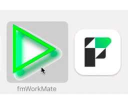

- TOC
{:toc}



# {{page.title}}

{{page.strapline}}

When setting up fmWorkMate there are three main tasks:

1. deciding what FileMaker to open fmWorkmate with - see [fmWorkMate App Setup](#fmworkmate-app-setup) below
2. setting up fmWorkMate itself - see [fmWorkMate Settings]
{: .float-front-right .w-32}
3. making sure you have all the tools you need - see [Install MrWatsons Tools]

## fmWorkMate App Setup

fmWorkMate is simply a collection of FileMaker files that you need to open in FileMaker.

{: .float-front-right .w-32}

### a) Quickstart - Just open fmWorkMate in FileMaker

The quickest way to get started is to open fmWorkMate in your normal FileMaker Pro installation.

This has both advantages and disadvantages:

- `+` You can integrate fmWorkMate and your solution more tightly
- `+` By using [fmIDE] you can jump from tools directly to things in your FileMaker IDE, for example
  - in [fmLogAnalyser] you can jump straight to broken code in a single click.
- `-` It can, however, be a bit fiddly switching between fmWorkMate and your solution files
- `-` Closing your solution may close fmWorkmate as well.

{: .float-front-right .w-64}

### b) fmWorkMate App - A dedicated FileMaker Pro installation

A good alternative is to set up a dedicated FileMaker Pro installation for fmWorkMate.

- `+` You can switch between your solution files and fmWorkMate by switching apps in the usual way
- `-` You can't necessarily jump directly from fmWorkMate to things in your solution files

{: .note }
For a real App feeling give the FileMaker Pro copy the fmWorkMate name **and icon**

On Mac
: Just duplicate your FileMaker Pro.app, rename it to `fmWorkMate.app`,  put it in your fmWorkMate folder and give it the fmWorkMate icon.

On Windows
: Either use the old windows runtime app, or, as far as I know, you can only run fmWorkMate separately by using a different FileMaker version

{: .float-front-right .w-32}

### c) Smart starting with fmLaunchPad

{: .side-note }
Expert tip!

The problem with multiple FileMaker Apps, is that they don't know which files to open.

{: .mrw-gold-bg }
With [fmLaunchPad] you can get each FileMaker App to open its main file automatically. 😍

mrwMarkdownLinks
[fmIDE]: fmide.html
[fmLaunchPad]: fmlaunchpad.html
[fmWorkMate Settings]: fmworkmate-settings.html
[Install MrWatsons Tools]: install-mrwatsons-tools.html
