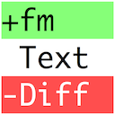
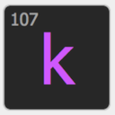

{: .mrw-orange-bg }
Just like corners of my toolkit this page is still very much in development.

- TOC
{:toc}



## {{page.title}}

{{page.strapline}}

### Introduction

I make tools primarily in my spare time for myself to [solve the everyday FileMaker problems](solutions-to-daily-problems.html) that I face as a 24 x 7 x 365 FileMaker developer.

Over the years I've produced [quite a collection of tools](a-system-of-integrated-tools.html) that I use every day in my FileMaker development work. Looking back at the history of these tools- which is well documented in the tools' history comments - I can see that they have evolved very much over time, and that they have been shaped and fed by the problems I have encountered in my daily work.

{: .note}
The image above shows an analysis of the history comments in the change log (first script) of all my tools - up to 2021. The size of the circles represents the number of comments in the code, and the lines between the circles represent the connections between the tools. The analysis shows that the tools have evolved over time, and that they have been shaped by the problems I have encountered in my daily work.

Once you've read the history here, you may be interested in [the Making of the History of MrWatson's Tools](the-making-of-the-history-of-mrwatsons-tools.html), which is a detailed look at how I track this information.

{: .clear}

---

### 2006 The Phoenix rises from the Ashes

I finally found my footing in the German FileMaker Community, and with Jens Teich did a [presentation on the new custom functions in FileMaker](videos.html#fmk2006---jens-teich--russell-watson---filemaker-7---custom-functions) at the FileMaker Conference in Chiemsee.

In 2006 I was beginning to dabble in AppleScript as a glue between FileMaker and other applications. 

{: .clear}

---

### 2007 AutoHotkey

Back then I was still mainly working on Windows computers. I was using AutoHotkey to automate repetitive tasks in FileMaker, and I was also using it to create custom keyboard shortcuts for FileMaker.

{: .clear}

---

### 2008 A murky beginning

[{:.w-64}](fmdbanalyser.html){:.float-front-right .mt--16}
The first of my tools was [fmDBAnalyser](fmdbanalyser.html) - an instant-analysis tool utilising the FileMaker Design Functions to query the structure of neighbouring databases.

Many of the functions in fmDBAnalyser are covered better by other tools these days (for example the MBS plugin let's you see internal IDs directly within the FileMaker GUI), but the relationship analysis and diffing still plays a very important role today when moving tables between files.

My interest in the FileMaker Clipboard grew. I discovered [FMCliboardBroker](https://www.key-planning.co.jp/software/fmclipboardbroker/fmclipboardbroker-english/) - originally an AppleScript Clipboard converter from japanese company Key Planning.

{: .clear}

---

### 2011 Things start taking off

As you can see from the diagramme of changes above, it was 2011 where I really got started. (At least, that's when I started documenting changes.😉)

[{:.w-64}](fmloganalyser.html){:.float-front-right .mt--16}
fmDBAnalyser was the main focus at the start, but **fmLogAnalyser** soon came into being

At the end of 2011  I joined GitHub because I felt it was a good thing…but it was 6 1/2 years before I first took a real bite!

{: .clear}

---

[{:.w-64}](fmworkmate.html){: .clear .float-front-right .mt--8}

### 2012 Things started snowballing

{: .clear .float-front-right}
[{:.w-64}](fmtextmultiplier.html) [{:.w-64}](fmtextseries.html) [{:.w-64}](fmtextconverter.html) [{:.w-64}](fmcheckmate.html)

fmWorkMate and fmCheckMate took off in 2012. Along with them came the text tools, shortly after followed by more and more tools.

{: .clear}

---

[{:.w-64}](fmsyntaxcolorizer.html){: .clear .float-front-right .mt--8}

### 2012 fmSyntaxColorizer

2012 the text tools started fmTextMultiplier, fmTextSeries, fmTextConverter

### 2013 The year for fmSyntaxColorizer

- December 2012 MBS Version 3.0 **Component: SyntaxColoring**
- October 2013 MBS Line Numbers in Scripts
- November 2013 MBS **Variable Checking**
- December 2013 MBS Version 3.5 with improvements in Syntax Colorising inc. Line numbers and Variable Checking!

{: .clear}

2013 was the year of the first dotfmp conference in Hamburg. I was there, and I was inspired by the spirit of sharing and learning. I was also inspired by the idea of open source, and I started to think about how I could contribute to the community.

{: .clear}

---

{: .clear .float-front-right}
[{:.w-64}](fmpastemate.html) [{:.w-64}](fmpluginmate.html) [{:.w-64}](fmtextdiff.html)

### 2013 fmPasteMate, fmPluginMate, fmTextDiff

More tools were thrown into the fmWorkMate toolbox

{: .clear}

---

{: .clear .float-front-right}
[{:.w-64}](fmclipboardviewer.html)
[{:.w-64}](fmsimplecalculator.html)

### 2014 fmClipboardViewer, fmSimpleCalculator (own file)

fmClipboardViewer was added to the fmWorkMate toolbox to help visualise and debug the clipboard contents.

fmSimpleCalculator - in the toolbox from the start - got a starter file of it's own in the same year.

{: .clear}

---

[{:.w-64}](fmplugininfo.html){: .clear .float-front-right}

### 2014 fmPluginInfo

was never released :-/

{: .clear}

---

[{:.w-64}](fmmodifierkeys.html){: .clear .float-front-right}

### 2015 fmModifierKeys

{: .clear}

---

### 2016 fmWorkMate Overview

This is how the system looked back in 2016 - schematic like a CPU chip.

That's a pretty cool diagramme of the `TPU` / Text Processing Unit!

And the magic of the MBS plugin is well represented.

---

[{:.w-64}](https://mbsplugins.eu){: .clear .float-front-right}

### March 2016 MBS 6.1 FM.DataType



MBS provides us with a great new function to get the data type of a value: `MBS( "FM.DataType" ; value )

Wrapped in a custom function, this is a great way to get the data type of a value in FileMaker:

MBS proves again to be lightyears ahead of Claris / FileMaker!

<section class="fullwidth mbs-bg">{{ mbs_fm_datatype | markdownify }}</section>

Note to self: *Not* everything is text!

[{:.w-64}](fmtouchbar.html){: .clear .float-front-right}

### 2016 fmTouchBar & MBS 6.5 TouchBar

First came the new MacBook Pro with TouchBar, then the MBS plugin made functions to programme it. 

…and then came fmTouchBar, an app to experiment with the TouchBar functions.

Time and UX never meant it never quite caught on and remained experimental.

{: .clear}

---

[{:.w-64}](fmkeypress.html){: .clear .float-front-right}

### 2017 fmKeyPress

LOL! The first change log entry in fmKeyPress says it all:

`20170120 MrW 0.1v0 Tiny and finy`.

And that it is - just a very tiny and very fine little app to do just one thing: show you the code of the key you just pressed.

[{:.w-64}](fmlatencymeter.html){: .clear .float-front-right}

### 2017 fmLatencyMeter

It was a time of home office and bad internet connections. So I created fmLatencyMeter to help me visualise and measure the latency of the connection.

To tell the truth it was actually a test app to show how you can use fmTextMultiplier to create a lot of objects on the clipboard - in this case the dots of the circle.

{: .clear}

---

[{:.w-64}](psbn.html){: .clear .float-front-right}

### 2017 PSBN / Perform Script by Name

FileMaker 16 focussed on supporting external APIs - connecting FileMaker and the WWW with *tons* of functions: cURL, JSON, Text & HexEncoding, Cryptography, etc. -> fantastic!

…Yet it was still not possible to build an *internal*, 'loose' API - from FileMaker file to FileMaker file.

FileMaker 15 had only hard coded file-references, script calls bound by internal IDs `from list` and Plugin functions, which could only perform scripts *ASYNCHRONOUSLY* (i.e. add it to the script stack, and never be able to get a ScriptResult back)…

Although `Perform Script by Name` was introduced later, thanks to the dynamic File References introduced in FM 16 - and some crazy programming from MrWatson (including a ton of automatically generated code), it became possible to realize a dream - Perform Script by Name, natively and synchronously

{: .clear}

---

[{:.w-64}](fmscriptworkspace.html){: .clear .float-front-right}

### 2017 fmScriptWorkspace

{: .clear}

---
[{:.w-64}](filemakerdoc.html){: .clear .float-front-right}

### 2017 FileMakerDoc

FileMakerDoc never quite got off the ground.

{: .clear}

---

[{:.w-64}](mrwatsons-repositories.html){: .clear .float-front-right}

### 2018 My First Commit to Github

My first commit to GitHub was the fmCheckMate-XSLT library on the 6th June 2018, in total 411 files. Over the next 7 years 62 commits have added nearly another 100 funcions to the library!

{: .clear}

---

[{:.w-64}](fmautomate.html){: .clear .float-front-right}
[{:.w-64}](fmkilldefaultfields.html){: .clear .float-front-right}

### 2019 fmAutoMate, fmKillDefaultFields

{: .clear}

---

[{:.w-64}](.html){: .clear .float-front-right}

### 2019 fmSetupAssistant

Presented in 2023 Rome FileMaker Week

First real use in 2025 during the [backporting of Günther Business Solutions' e-Rechnung module](case-study-backporting-e-invoice-solution-gbs.html).

{: .clear}

---

[{:.w-64}](fmlaunchpad.html){: .clear .float-front-right}
### 2020 fmLaunchPad - We have lift off!

So it was written in the change log: `20200928 @mrwatson-de v0.1 We have lift off!`

[{:.w-64}](fmmetamate.html){: .clear .float-front-right}
### 2020 fmMetaMate

{: .clear}

---

[{:.w-64}](dotfmp.html){: .clear .float-front-right}

### 2021 dotfmp "We share because we can!"

- demise of runtime solutions

{:.mrw-orange-bg}
fmWorkMate goes open-source at dotfmp 2021.

The main question was: What (open source) licence to use?

{: .clear}

---

[{:.w-64}](fmide.html){: .clear .float-front-right}

### 2022 fmIDE

Wow!

{: .clear}

---

[{:.w-64}](fmurldecode.html){: .clear .float-front-right}

### 2022 fmUrlDecode

Tired with the slow downloading from the Claris ETS website, I needed a solution to download the files with a fast downloader app. The problem was I needed to feed it the direct url to the file, and that was encoded as a url parameter.

=> I created [fmUrlDecode](fmurldecode.html)

{: .clear}

---

[{:.w-64}](fmthings.html){: .clear .float-front-right}

### 2024 fmThings

`20240219 @mrwatson-de v0.1 Start of a crazy dream`
{: .clear}

---

[{:.w-64}](mrwatsons-repositories.html){: .clear .float-front-right}

### 2024 3 years and 800 commits later

A tweet in June 2024 fondly looks back on the open source journey thus far.

<blockquote class="twitter-tweet">
Fondly remembering what <a href="https://twitter.com/hashtag/dotfmp?src=hash&amp;ref_src=twsrc%5Etfw">#dotfmp</a> has given us over the years: &quot;we share because we can!&quot; 3 years ago I popped the big question in the main hall: What (open source) licence?  Since then I&#39;ve mode 800 contributions to GitHub. So cheers Egbert 🍻 &amp; long live the spirit of dotfmp! ❤️ <a href="https://t.co/PgTLPgGGHO">pic.twitter.com/PgTLPgGGHO</a>
&mdash; 🇺🇦Russell Watson (@mrwatson_de) <a href="https://twitter.com/mrwatson_de/status/1802778749722665356?ref_src=twsrc%5Etfw">June 17, 2024</a></blockquote> 

{: .clear}

---

### 2025 Q1 e-Invoices

[{:.w-64}](fmsetupassistant.html){: .clear .float-front-right}

#### fmSetupAssistant

### 2025 Q2 fmIDE Chrome Extension

Coming soon

### 2025 fmWorkMate Overview

A new attempt to illustrate how the tools hang together - since 2016 the Integration tools have arrived.

### 2025 Q2 New Website

Historic day! On Tuesday, 20th May 2025, I finally launched the new website for my tools, fmworkmate.com - albeit in a half baked state - so, the standard state of most of my first releases.

The new website is a complete overhaul of the old website - indeed a replacement - and it is now much easier to navigate and find the tools and tips you need. Whereas mrwatson.de and fmworkmate.com used to reference the same website, they now have a split personality:

- [fmworkmate.com](https://fmworkmate.com/) = home of my tools
- [mrwatson.de](https://mrwatson.de/) = home of my blog
